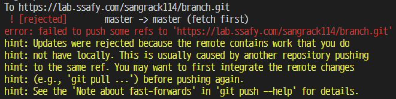
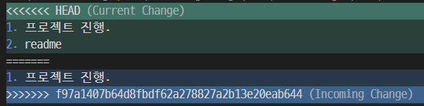
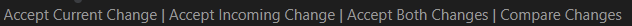
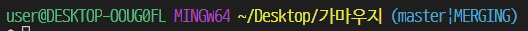

# git 커밋 이슈




- 깃 내역 확인

git log --oneline


- window pull

  git pull origin master




선택 가능




확인 



git push origin master

<<<<<<< HEAD
=======


# 강제 push


># git Error
>
>! [rejected]        master -> master (fetch first)
>error: failed to push some refs to 'https://github.com/sang-rak/TIL.git'
>hint: Updates were rejected because the remote contains work that you do
>hint: not have locally. This is usually caused by another repository pushing
>hint: to the same ref. You may want to first integrate the remote changes
>hint: (e.g., 'git pull ...') before pushing again.
>hint: See the 'Note about fast-forwards' in 'git push --help' for details.

위와 같은 에러가 발생하는 이유는 기존의 데이터가 손실이 있기 때문이다 해결 방법은

아래 코드를 사용하면 된다. 단 기존 데이터는 보장하지 못한다.

```python
$ git push origin +master
```

>>>>>>> d24939cc558199655e06339359d371b4e75bc0c2
