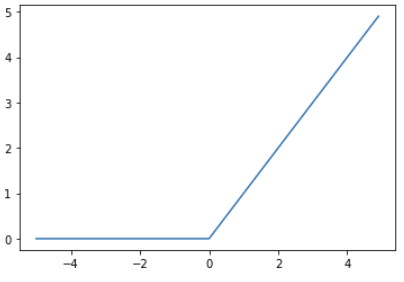

# CHAPTER 3 신경망

- **목차**

# 1. 퍼셉트론에서 신경망으로

- 좋은 소식: 퍼셉트론으로 복잡한 함수도 표현할 수 있다는 것
- 나쁜 소식: 가중치를 설정하는 작업은 여전히 사람이 수동으로 한다는 것

## 1.1 신경망의 예

- 신경망
    - 입력층
    - 은닉층 : 뉴런이 사람 눈에 보이지 않는다.
    - 출력층

    

## 1.2 퍼셉트론 복습

- b는 **편향**을 나타내는 매개변수 → 뉴런이 얼마나 쉽게 활성화 되는지 제어
- $w_1, w_2$는 **가중치**를 나타내는 매개변수 → 각 신호의 영향력을 제어

    $$[식3.1] \space y = {0 (b+w_1*x_1 + w_2*x_2 \le 0), 
     1(b+w_1*x_1+w_2*x_2>0)} $$


- **편향**을 명시한 그림


## 1.3 활성화 함수의 등장

- 활성화함수 : 입력 신호의 총합이 활성화를 일으키는지를 정하는 역할

# 2. 활성화 함수

- 계단함수: 임계값을 경계로 출력이 바뀌는 활성화 함수

## 2.1 시그모이드 함수

- 활성화 함수중 시그모이드 함수를 나타낸식

신경망에서 활성화함수로 시그모이드 함수를 이용하여 

신호를 변환하고 변환된 신호를 다음 뉴런에 전달한다


## 2.2 계단 함수 구현하기

- 계단함수 구현

```python
def step_fuction(x):
	if X > 0:
		return 1
	else:
		return 0
```

❌단점❌

인수 x는 실수(부동소수점)만 받아들인다. 

즉, step_function(3.0)은 되지만 넘파이 배열을 인수로 넣을 수 는 없습니다.

가령 step_function(np.array([1.0, 2.0])는 안됩니다.

넘파이 배열도 지원하도록 수정하려면 다음과 같은 구현을 해야합니다.

```python
def step_fuction(x):
	y = x > 0
	return y.astype(np.int)
```

이는 넘파이의 편리한 트릭을 이용한 것입니다.

넘파이 배열에 부등호 연산을 수행하면 배열의 원소 각각에 부등호 연산을 수행한 bool 배열이 생성 됩니다.

이 y는 bool배열입니다. 그래서 배열 y의 원소를 bool에서 int형으로 바꿔줍니다.


## 2.3 계단 함수의 그래프

- 계단함 수를 그래프로 그리기 위해 matplotlib 라이브러리를 사용합니다.

```python
import numpy as np
import matplotlib.pylab as plt

def step_function(x):
    return np.array(x > 0, dtype = np.int)

x = np.arange(-5.0, 5.0, 0.1)
y = step_function(x)
plt.plot(x,y)
plt.ylim(-0.1, 1.1) # y축의 범위 지정
plt.show()
```

np.arange(-5.0, 5.0, 0.1)은 -5.0에서 5.0 전까지 0.1 간격의 넘파이 배열을 생성 합니다

step_function()은 인수로 받은 넘파이 배열의 원소 각각을 인수로 계산함수 실행해 결과를 배열로 만들어 돌려 줍니다.

이 x, y 배열을 그래프로 그리면 아래 그림 처럼 됩니다.


## 2.4 시그모이드 함수 구현하기

- 시그모이드 함수 구현

```python
# x 가 넘파이 배열이어도 올바른 결과가 나온다.
def sigmoid(x):
    return 1 / (1 + np.exp(-x)
```

- 실험

    

넘파이 배열도 처리해주는 이유는 넘바이의 **브로드 캐스트**에 있습니다.

🧰 **브로드캐스트 기능:** 넘파이 배열과 스칼라 값의 연산을 넘파이 배열의 원소 각각과 스칼라값의 연산으로 바꿔 수행.

- 시그모이드 함수 그래프 구현

```python
x = np.arange(-5.0, 5.0, 0.1)
y = sigmoid(x)
plt.plot(x,y)
plt.ylim(-0.1, 1.1) # y축의 범위 지정
plt.show()
```


## 2.5 시그모이드 함수와 계단 함수 비교

두함수를 함께 그리면 아래와 같습니다.


차이점이라면 '매끄러움'의 차이가 있습니다 시그모이드함수는 부드러운 곡선이며 입력에 따라 출력이 연속적으로 변화합니다. 매끄러움은 신경망학습에서 중요한 역할을 하게 됩니다.

공통점은 입력이 커지면 출력이 1에 커지고 입력이 중요하지 않으면 작은 값을 출력합니다.

## 2.6 비선형 함수

시그모이드 함수와 계단함수는 비선형 함수로 분류됩니다.

신경망에서는 활성화함수로 비선형 함수를 사용해야합니다.

선형 함수의 문제는 층을 아무리 깊게 해도 '은닉층이 없는 네트워크'로도 똑같은 기능을 할 수 있기 때문입니다. 

구체적인 예로 H(x) = cx 를 활성화함수로 사용하면 3층 네트워크 식은 Y(x) = H(H(H(x)))가 됩니다. 

이 계산은 y(x) = c*c*c*x 처럼 곱셈을 세 번 수행하지만 실은 Y(x) = ax와 같은 식입니다 이 예처럼 선형 함수를 이용해서는 여러 층으로 구성하는 이점을 살릴 수 없습니다. 그래서 층을 쌓는 혜택을 얻고 싶다면 활성화 함수로는 반드시 비선형 함수를 사용해야 합니다.

## 2.7 ReLU 함수

ReLU는 입력이 0을 넘으면 그 입력을 그대로 출력하고, 0 이하이면 0을 출력하는 함수입니다.

```python
def relu(x):
    return np.maximum(0, x)

x = np.arange(-5.0, 5.0, 0.1)
y = relu(x)
plt.plot(x,y)
plt.show()
```

- Relu함수의 그래프

    

# 3. 다차원 배열의 계산

넘파이의 다차원 배열을 이용한 계산법을 숙달하면 신경망을 효율적으로 구현 가능합니다.

## 3.1 다차원 배열

- 1차원 배열

    

이와 같이 배열의 차원 수는 np.ndim()함수로 확인할 수 있습니다.

배열의 형상은 인스턴스 변수인 shape으로 알 수 있습니다.

이 예에서 A는 1차원 배열이고 원소 4개로 구성되어 있음을 확인 할 수 있습니다.

❌주의❌

A.shaped은 튜플을 반환 합니다.

- 2차원 배열

    

2차원 배열은 행렬이라고 부르고 가로방향을 행(row) 세로방향을 열(column)이라고 합니다.

## 3.2 행렬의 곱

행렬의 곱을 구하는 방법을 알아보겠습니다.

행렬의 곱은 왼쪽 행렬의 행(가로)가 오른쪽 행렬의 열(세로)을 원소별로 곱하고 그 값들을 더해서 계산합니다. 

그리고 그 계산 결과가 새로운 다차원 배열의 원소가 됩니다. 예를 들어 A의 1행과 B의 1열을 곱한 값은 결과 행렬의 1행 1번째 원소가 되고 A의 2행과 B의 1열을 곱한 결과는 2행 1번째 원소가 됩니다. 

이 계산을 파이썬으로 구현하면 다음과 같습니다.


이 코드에서 A와 B는 2 X 2 행렬이며, 두 행렬의 곱은 넘파이 함수 np.dot()으로 계산합니다.

np.dot()은 입력이 1차원 배열이면 벡터를, 2차원 배열이면 행렬 곱을 계산합니다.

❌주의❌

np.dot(A, B)와 np.dot(B, A)는 다른 값이 될 수 있다는 점입니다.

다음은  2 X 3 행렬과 3 X 2 행렬의 곱을 파이썬으로 구현한 것입니다.


❌주의❌

**행렬의 형상**에 주의 해야합니다. 

구체적으로는 행렬 A의 1번째 차원의 원소 수(열 수)와 행렬 B의 0번째 차원의 원소 수(행 수)가 같아야 합니다. 앞의 예에서도 둘 모두 원소가 3개씩이였던것 처럼 이 값이 다르면 행렬의 곲을 계산할 수 없습니다. 

실제로 2 X 3 행렬 A와 2 X 2 행렬 C를 곱하면 파이썬은 다음과 같은 오류를 출력합니다.


## 3.3 신경망에서의 행렬 곱

- 행렬의 곱으로 신경망의 계산을 수행합니다.

    

    

# 4. 3층 신경망 구현하기

3층신경망: 입력층(0층)은 2개, 첫 번째 은닉층(1층)은 3개, 두번째 은닉층(2층)은 2개, 출력층(3층)은 2개의 뉴런으로 구성된다.


## 4.1 표기법 설명


## 4.2 각 층의 신호 전달 구현하기

- 입력층에서 1층으로 신호 전달


은닉층에서  가중치 합을 $a^1_1$로 표기하고 활성화 함수 h()로 변환된 신호를 Z값으로 표현합니다.

이를 파이썬으로 구현하면 


- 1층에서 2층으로의 신호 전달

    


이 구현은 1층의 출력 Z1이 2층의 입력이 된다는 점을 제외하면 조금전의 구현과 같습니다.

- 2층에서 출력층으로의 신호 전달

    

```python
def identity_function(x):
    return x

W3 = np.array([[0.1, 0.3], [0.2, 0.4]])
B3 = np.array([0.1, 0.2])

A3 = np.dot(Z2, W3) + B3
Y = identity_function(A3)
```

여기서는 항등함수인  identity_function()을 정의하고, 이를 출력층의 활성화 함수로 사용했습니다.

✍🏼정리 

출력층의 활성화 함수는 풀고자 하는 문제에  따라 달라집니다. 회귀에는 항등함수를, 2클래스 분류에는 시그모이드 함수를, 다중 클래스 분류에는 소프트맥스 함수를 사용하는것이 일반적입니다.

## 4.3 구현 정리

지금까지의 구현을 정리해본 코드입니다.


init_network(): 가중치와 편향을 초기화 → 딕셔너리 변수인 network에 저장

network: 각 층에 필요한 매개변수(가중치와 편향)를 저장

forward(): 입력 신호를 출력으로 변환하는 처리 과정을 구현

여기까지 순전파인 신경망의 순방향 구현을 마칩니다.

# 5. 출력층 설계하기

기계학습 문제는 **분류(classification)**와 **회귀(regression)**로 나뉩니다.

**분류**: 데이터가 어느 클래스에 속하느냐는 문제

**회귀**: 입력데이터에서 (연속적인)수치를 예측하는 문제

## 5.1 항등 함수와 소프트맥스 함수 구현하기

**항등함수**는 입력을 그대로 출력합니다.

- **소프트맥스 함수의 식**은 다음과 같습니다.

    

이 소프트 함수를 그림으로 나타내면 식에서 보듯 출력층의 각 뉴런이 모든 입력신호에서 영향을 받기 때문에 소프트 맥스의 출력은 모든 입력신호의 지수 함수의 합으로 구성됩니다.


- 파이썬 구현은 다음과 같습니다.

    

앞으로 사용하기위해 함수로 정의해둡니다.

```python
def softmax(a):
    exp_a = np.exp(a)
    sum_exp_a = np.sum(exp_a)
    y = exp_a / sum_exp_a
    return y
```

## 5.2 소프트맥스 함수의 주의점

파이썬의 특성상 계산시 **오버플로 문제**를 해결해야 합니다.

**오버플로(overflow)**: 표현할 수 있는 수의 범위가 한정되어 너무 큰값은 표현 할 수 없다.

소프트맥스 함수는 지수함수를 사용하여 아주 큰값을 리턴합니다. 이경우 python에서는 무한대를 뜻하는 inf가 되어 돌아옵니다. 그리고 이런 큰 값끼리 나눗셈을 하면 결과 수치가 '불안정'해집니다.

- **오버플로 문제**를 개선하기위해 한 수식입니다.

    

    분모 분자에 C를 곱하여도 결국 결과는 바뀌지 않음

    이를 이용하여 C에 입력신호중 최댓값을 이용하여 오버플로 문제를 해결

```python
def softmax(a):
	c = np.max(a)
	exp_a = np.exp(a - c) # 오버플로 대책
	sum_exp_a = np.sum(exp_a)
	y = exp_a / sum_exp_a

return y 
```

## 5.3 소프트맥스 함수의 특징

- softmax() 함수를 사용하면 다음과 같이 계산

    

소프트맥스 함수의 출력은 0에서 1.0 사이의 실수입니다. 또한 소프트맥스 함수 출력의 총합은 1

이 성질 덕분에 소프트맥스 함수의 출력을 '확률'로 해석가능 합니다.

신경망을 이용한 분류에서는 일반적으로 가장 큰 출력을 내는 뉴런에 해당하는 클래스로만 인식

→ 소프트 맥스 적용해도 출력이 가장 큰 뉴런의 위치는 변하지 않음 → 생략가능

현업에서는 지수함수 계산에 드는 자원 낭비를 줄이고자 추론단계에서는  출력층의 소프트맥스 함수는 생략하는 것이 일반적입니다.  신경망 학습단계에서는 소프트맥스 함수를 사용합니다.

## 5.4 출력층의 뉴런 수 정하기

- 분류에서는 분류하고 싶은 클래스 수로 설정

# 6. 손글씨 숫자 인식

- 신경망의 문제 해결 단계
    1. 학습: 훈련데이터를 사용해 매개변수(가중치와 편향)를 학습
    2. 추론: 학습한 매개변수를 사용하여 입력데이터를 분류 

## 6.1 MNIST 데이터 셋

- 특징
1. 0부터 9까지의 숫자 이미지로 구성됩니다.
2. 훈련 데이터셋 6만장 테스트 데이터셋 만장이 준비되어 있습니다.
3. 28 X 28 크기의 회색조 이미지(1채널)
4. 각 픽셀은 0~255까지의 값을 취합니다.
5. 각 이미지에는 라벨링이 되어 있습니다.

- 깃허브 로컬저장 MNIST URL

[oreilly-japan/deep-learning-from-scratch](https://github.com/oreilly-japan/deep-learning-from-scratch)

- 불러오는 파이썬 코드

```python
import sys, os
sys.path.append(os.pardir) # 부모 디렉터리의 파일을 가져올 수 있도록 설정
from dataset.mnist import load_mnist

#처음 한 번은 몇 분 정도 걸립니다.
(x_train, t_rain), (x_test, t_test) = \
	load_mnist(flatten=True, normalize=False)

#각 데이터의 형상 출력
print(x_train.shape) # (60000, 784)
print(t_train.shape) # (60000,)
print(x_test.shape) # (10000, 784)
print(t_test.shape) # (10000,)
```

❌수정❌ 

sys.path.append(os.pardir): 부모 디렉터리의 파일을 가져올 수 있도록 하는 코드 삭제 

대신 환경을 [mnist.py](http://mnist.py) 하위폴더에 설정

```python
import sys, os
from mnist import load_mnist

#처음 한 번은 몇 분 정도 걸립니다.
(x_train, t_train), (x_test, t_test) = load_mnist(flatten=True, normalize=False)

#각 데이터의 형상 출력
print(x_train.shape) # (60000, 784)
print(t_train.shape) # (60000,)
print(x_test.shape) # (10000, 784)
print(t_test.shape) # (10000,)
```

파이썬에는 pickle이라는 기능이 있습니다. 이는 프로그램 실행 중에 특정 객체를 파일로 저장하는 기능입니다. 저장해둔 pickle파일을 로드하면 실행 당시의 객체를 즉시 복원할 수 있습니다.


mnist.pkl 이 생성된 모습

- 데이터 확인을 위해 MNIST 이미지를 화면으로 불러옵니다.

    

    실행하면 PNG 사진 형태로 나타납니다.

    

❌주의❌

flatten = True로 설정해 읽어 드린 이미지는 1차원 넘파이 배열로 저장되어 있습니다. 

이미지를 표시할 때는 원래 형상인 28 X 28 크기로 다시 변형해야 합니다.

reshape()를 통해 원하는 형상으로 변환합니다.

또한 넘파이로 저장된 이미지 데이터를 PIL용 데이터 객체로 변환하기위해 Image.fromarray()를 사용합니다.

## 6.2 신경망의 추론 처리

MNIST 데이터셋을 가지고 신경망을 구현 합니다.

- 입력층: 784
- 출력층: 10
- 은닉층 2개 (첫 번째 은닉층: 50 두 번째 은닉층: 100)

    ```python
    def get_data():
        (x_train, t_train), (x_test, t_test) = load_mnist(flatten=True, normalize=True, one_hot_label=False)
        return x_test, t_test

    def init_network():
        with open("sample_weight.pkl", 'rb') as f:
            network = pickle.load(f)
            
        return network

    def predict(network, x):
        W1, W2, W3 = network['W1'], network['W2'], network['W3']
        b1, b2, b3 = network['b1'], network['b2'], network['b3']
        
        a1 = np.dot(x, W1) + b1
        z1 = sigmoid(a1)
        a2 = np.dot(z1, W2) + b2
        z2 = sigmoid(a2)
        a3 = np.dot(z2, W3) + b3
        y = softmax(a3)
        
        return y
    ```

- 정확도 평가 코드


❌주의❌

- 이전에 만들었던 코드를 적용시켜야 한다.

```python
sys.path.append(os.pardir) 
import numpy as np
import pickle

def sigmoid(x):
    return 1/(1+np.exp(-x))

def softmax(a):
    c = np.max(a)
    exp_a = np.exp(a - c) # 오버플로 대책
    sum_exp_a = np.sum(exp_a)
    y = exp_a / sum_exp_a
    return y 

def get_data():
    (x_train, t_train), (x_test, t_test) = load_mnist(flatten=True, normalize=True, one_hot_label=False)
    return x_test, t_test

# 학습된 가중치 매개변수 읽기
def init_network():
    with open("sample_weight.pkl", 'rb') as f:
        network = pickle.load(f)        
    return network

def predict(network, x):
    W1, W2, W3 = network['W1'], network['W2'], network['W3']
    b1, b2, b3 = network['b1'], network['b2'], network['b3']
    
    a1 = np.dot(x, W1) + b1
    z1 = sigmoid(a1)
    a2 = np.dot(z1, W2) + b2
    z2 = sigmoid(a2)
    a3 = np.dot(z2, W3) + b3
    y = softmax(a3)
    
    return y
```

- 정확도가 93% 인것을 확인할 수 있다.


## 6.3 배치 처리

- 신경망 각 층의 가중치 형상 출력

    

    다차원 배열의 대응하는 차원의 원소수가 일치함을 확인

    만약 이미지 여러장을 한꺼번에 입력하는 경우는 입력층 형상을 100 X 784로 바꾸면 됩니다.

    이렇게 하나로 묶은 입력 데이터를 배치(batch)라 합니다.

    ```python
    x, t = get_data()
    network = init_network()

    batch_size = 100 # 배치크기
    accuracy_cnt = 0
    # 원본 사이즈 / 배치 사이즈 크기만큼 반복한다
    for i in range(0, len(x), batch_size):
        x_batch = x[i:i+batch_size]
        y_batch = predict(network, x_batch)
        # 리스트중 가장 높은 인덱스를 반환한다
        p = np.argmax(y_batch, axis=1)
        #원본이랑 몇 개가 맞았는지 여부파악
        accuracy_cnt += np.sum(p == t[i:i+batch_size])
    # 리스트에서 1(정답)값을 전체 대조 횟수로 나누어 정확도를 구한다
    print("Accuracy:" + str(float(accuracy_cnt) / len(x)))
    ```

# 7. 정리

- 신경망에서는 활성화 함수로 시그모이드 함수와 ReLU함수 같은 매끄럽게 변화하는 함수를 이용한다.
- 넘파이 다차원 배열을 잘 사용하면 신경망을 효율적으로 구현할 수 있다.
- 기계학습 문제는 크게 회귀와 분류로 나눌 수 있다.
- 출력층의 활성화 함수로는 회귀에서는 주로 항등 함수를, 분류에서는 주로 소프트맥스 함수를 이용한다.
- 분류에서는 출력층의 뉴런 수로 분류하려는 클래스 수와 같게 설정한다.
- 입력 데이터를 묶은 것을 배치라 하며, 추론 처리를 이 배치 단위로 진행하면 결과를 훨씬 빠르게 얻을 수 있다.
