# CHAPTER 4 신경망 학습

# 1. 데이터에서 학습한다!

- 손실함수: 신경망이 학습 할 수 있도록 해주는 지표
- 신경망 학습: 데이터로부터 매개변수의 값을 정하는 방법

2장의 퍼셉트론(선방향)은 선형분리가능 문제라면 퍼셉트론 수렴정리를 통해 데이터로 부터 자동으로 학습 가능하지만 비선형 분리 문제는 자동으로 학습 할 수 없습니다.

## 1.1 데이터 주도학습

딥러닝을 종단간 기게학습이라고도 한다. 여기서 종단간은 '처음부터 끝까지'라는 의미로, 데이터(입력)에서 목표한 결과(출력)를 사람의 개입 없이 얻는다는 뜻을 담고 있다.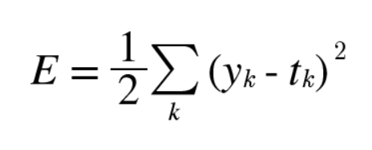

- **SIFT: Scale Invariant Feature Trasform**

    사진에서 코너점등 식별이 용이한 특징점들을 선택한 후에 각 특징점을 중심으로 한 로컬 패치에 대해 특징 벡터를 추출한 것

    이미지의 크기 및 회전에 영향을 받지 않는 특징점을 추출하는 알고리즘

- **HOG: Histogram of Oriented Gradient**

    대상영역을 일정 크기의 셀로 분할하고, 각 셀마다 edge 픽셀들의 방향에 대한 히스토그램을 구한 후 이들 히스토그램 bin 값들을 일렬로 연결한 벡터이다.

    영상의 밝기 변화, 조명 변화에 덜 민감한 알고리즘

## 1.2 훈련 데이터와 시험 데이터

❌주의❌

범용적으로 사용할 수 있는 모델을 원하기에 **범용능력**을 제대로 평가하기 위해 훈련 데이터와 시험 데이터를 분리 하여야 한다.

**범용능력**: 아직 보지못한 데이터로도 문제를 올바르게 풀어내는 능력 

**오버피팅**: 한 데이터셋에만 지나치게 최적화된 상태

# 2. 손실 함수

신경망은 **손실함수**를 기준으로 최적의 매개변수 값을 탐색 합니다.

**손실함수**: 신경망 선응의 '나쁨'을 나타내는 지표로 현재의 신경망이 훈련 데이터를 얼마나 잘 처리하지 못하느냐를 나타낸다.

## 2.1 오차제곱합

가장 많이 쓰이는 손실함수는 오차제곱 입니다.

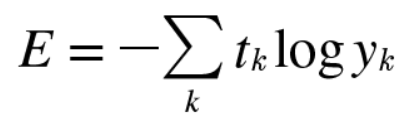

여기서 $y_t$는 신경망의 출력, $t_k$는 정답 레이블 , k 는 데이터의 차원수를 나타냅니다.

```python
y = [0.1, 0.05, 0.6, 0.0, 0.05, 0.1, 0.0, 0.1, 0.0, 0.0]
t = [0, 0, 1, 0, 0, 0, 0, 0, 0, 0]
```

출력 y는 소프트맥스 함수의 출력입니다.

소프트맥스 함수의 출력은 확률로 해석 할 수 있으므로 이미지가 '0' 일 확률은 0.1, '1'일 확률은 0.05 라고 해석 됩니다.

정답레이블인 t는 정답을 가리키는 위치의 원소는 1로 하고 그외는 0으로 나타내는 표기인 원-핫 인코딩을 진행하였습니다.

파이썬으로 오차제곱합 코드는 아래와 같습니다.

```python
def sum_squares_error(y, t):
	return 0.5 * np.sum((y-t)**2) 

y = [0.1, 0.05, 0.6, 0.0, 0.05, 0.1, 0.0, 0.1, 0.0, 0.0]
t = [0, 0, 1, 0, 0, 0, 0, 0, 0, 0]

sum_squares_error(np.array(y), np.array(t))

#결과값
0.09750000000000003
```

y 값이 7일 확률이 가장 높다고 추정하면 손실함수가 높아진 것을 볼 수 있습니다.

```python
y = [0.1, 0.05, 0.1, 0.0, 0.05, 0.1, 0.0, 0.6, 0.0, 0.0]
t = [0, 0, 1, 0, 0, 0, 0, 0, 0, 0]

sum_squares_error(np.array(y), np.array(t))
#결과값
0.5975
```

두 가지 예의 결과로 첫번째 추정 결과가 정답에 더 가까울 것으로 판단할 수 있습니다.

## 2.2. 교차 엔트로피 오차

또 다른 손실 함수로써 **교차 엔트로피 오차**를 사용합니다.

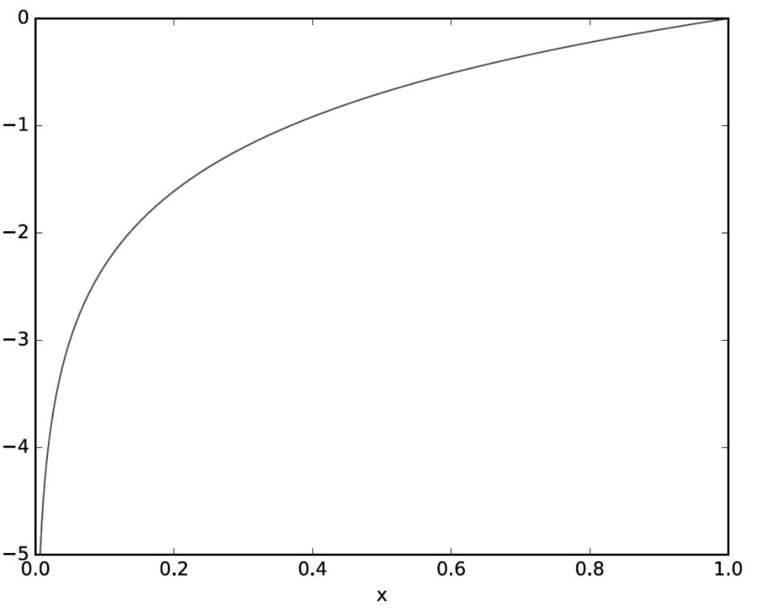

식 4.2

❌주의❌

여기서 log는 밑이 e인 자연로그입니다.

$y_k$는 신경망의 출력, $t_k$는 정답 레이블 입니다.

$t_k$는 정답에 해당하는 인덱스의 원소만 1이고 나머지는 0입니다.  

교차엔트로피 오차는 정답일 때의 출력이 전체 값을 결정하게 됩니다.

- 자연로그 y=log(x)의 그래프

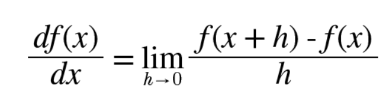

x가 1일때는 y는 0이 되고 x가 0에 가까워질수록 y의 값은 점점 작아집니다. 교차엔트로피도 마찬가지로 정답에 해당하는 출력 커질수록 0에 다가가다가 그 출력이 1일 때 0이됩니다.

교차엔트로피 오차를 구현합니다.

```python
def cross_entropy_error(y, t):
  delta = 1e-7
  return -np.sum(t * np.log(y + delta))
```

❌주의❌

delta를 더한이유는 np.log()함수에 0을 입력하면 -inf가 되어 더 이상 계산을 진행할 수 없게 되기 때문입니다.

```python
#첫 번째 예
y = [0.1, 0.05, 0.6, 0.0, 0.05, 0.1, 0.0, 0.1, 0.0, 0.0]
t = [0, 0, 1, 0, 0, 0, 0, 0, 0, 0]

cross_entropy_error(np.array(y), np.array(t))

#결과값
0.510825457099338

#두 번째 예
y = [0.1, 0.05, 0.1, 0.0, 0.05, 0.1, 0.0, 0.6, 0.0, 0.0]
t = [0, 0, 1, 0, 0, 0, 0, 0, 0, 0]

cross_entropy_error(np.array(y), np.array(t))

#결과값
2.302584092994546
```

결과값을 보면 앞서 진행한 오차제곱합과 판단이 일치합니다.

## 2.3 미니배치 학습

MNIST 데이터셋은 훈련 데이터가 60,000개 이므로 모든 데이터를 대상으로 손실 함수의 합을 구할려면 시간이 걸리기에 신경망 학습에서 훈련 데이터로부터 일부만 골라 학습을 수행한다.

그 일부를 미니배치라고 하며 가령 60,000장의 훈련 데이터 중에서 100장을 무작위로 뽑은 학습 방법이 미니배치 학습이다.

```python
import sys, os
sys.path.append(os.pardir)
import numpy as np

from dataset.mnist import load_mnist
(x_train, t_train),(x_train,t_test) = load_mnist(normalize=True, one_hot_label=True)
print(x_train.shape)
print(t_train.shape)

#결과값
(10000, 784)
(60000, 10)
```

코드를 돌린 결과 훈련 데이터는 60,000개이고 입력 데이터는 784열인 이미지 데이터임을 알 수 있다. 정답 레이블을 10줄짜리 데이터이며 x_train, t_train의 모습은 각각(60000,784)와 (60000,10)이 된다.

만약 훈련 데이터에서 무작위로 10장만 빼내려면 np.random.choice()함수를 쓰면 된다.

```python
import sys, os
sys.path.append(os.pardir)
import numpy as np

from dataset.mnist import load_mnist
(x_train, t_train),(x_train,t_test) = load_mnist(normalize=True, one_hot_label=True)

train_size = x_train.shape[0]
batch_size = 10
batch_mask = np.random.choice(train_size, batch_size)
x_batch = x_train[batch_mask]
t_batch = t_train[batch_mask]
```

0~60000 미만의 수 중에서 무작위로 10개 골라내기 위해서는 np.random.choice(60000,10) 사용한다.

## 2.4 (배치용) 교차 엔트로피 오차 구현하기

미니배치 같은 배치 데이터를 지원하는 교차 엔트로피 오차를 구현하기 위해서는 교차 엔트로피 오차(데이터를 하나씩 처리하는 구현)를 조금만 바꿔주면 된다.

```python
import numpy as np
def cross_entropy_error(y, t):
		# 차원이 1 차원일때
    if y.ndim ==1:

        t = t.reshape(1,t.size)
        y = y. reshape(1, y.size)

    batch_size = y.shape[0]

    return -np.sum(t*np.log(y+1e-7))/batch_size
```

위 코드는 데이터가 하나인 경우와 데이터가 배치로 묶여 입력될 경우 모두를 처리할 수 있도록 구현 되었다.

이 코드에서 y는 신경망의 출력, t는 정답 레이블이다. y가 1차원이라면, 즉 데이터 하나당 교차 엔트로피 오차를 구하는 경우는 reshape 함수로 데이터의 형상을 바꿔준다.

배치의 크기로 나눠 정규화하고 이미지 1장당 평균의 교차 엔트로피 오차를 계산한다.

정답레이블이 원-핫 인코딩이 아니라 '2'나 '7'등의 숫자 레이블로 주어졌을 때의 교차 엔트로피 오차는 다음과 같이 구현 할 수 있습니다.

## 2.5 왜 손실 함수를 설정하는가?

- 정확도라는 지표를 놔두고 손실 함수의 값이라는 우회적 방법을 택하는 이유는?

    정확도를 지표로 하면 매개변수의 미분이 대부분의 장소에서 0이 되어 갱신할 수 없기 때문이다.

    정확도는 매개변수의 미소한 변화에는 거의 반을을 보이지않고 반응이 불연속적으로 갑자기변한다. (계단함수를 활성화 함수로 사용하지 않는 이유와도 같다.)

# 3. 수치 미분

## 3.1 미분

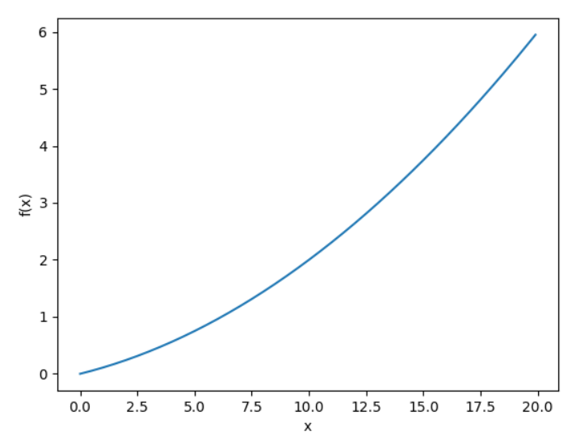

함수의 이름은 **수치 미분**에서 따온 numerical_diff(f,x)로 한다.

**수치 미분**: 아주작은 차분으로 미분하는것

```python
def numerical_diff(f, x):

    h = 1e-4 # 0.0001

    return (f(x+h) - f(x-h)) / (2*h)
```

## 3.2 수치 미분의 예

아래 코드는 $y=0.01x^2 + 0.1x$를 나타낸 파이썬 코드이다.

```python
def function_1(x):

    return 0.01*x**2 + 0.1*x
```

이어서 이 함수를 그려보면

```python
import numpy as np
import matplotlib.pylab as plt

def function_1(x):

    return 0.01*x**2 + 0.1*x

x = np.arange(0.0, 20.0, 0.1) # 0에서 20까지 0.1 간격의 배열 x를 만든다(20은 미포함).
y = function_1(x)
plt.xlabel('x')
plt.ylabel('f(x)')
plt.plot(x, y)
plt.show()
```

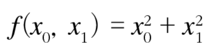

계산된 미분 값은 x에 대한 f(x)의 변화량, 즉 함수의 기울기에 해당한다. 그리고 x가 5일때와 10일 때의 진정한 미분은 차례로 0.2와 0.3이다.

파이썬 결과는 아래와 같다.

```python
def numerical_diff(f, x):

    h = 1e-4 # 0.0001

    return (f(x+h) - f(x-h)) / (2*h)

def function_1(x):

    return 0.01*x**2 + 0.1*x

print(numerical_diff(function_1, 5))
print(numerical_diff(function_1, 10))

#결과값
0.1999999999990898
0.2999999999986347
```

앞의 수치 미분과 결과를 비교하면 그 오차가 매우 작음을 알 수 있습니다.

## 3.3 편미분

편미분 : 변수가 여럿인 함수에 대한 미분

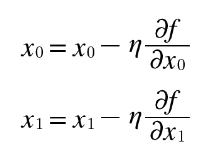

```python
def function_2(x):
    return x[0]*s*2 + x[1]**2  #또는 return np.sum(x**2)
```

인수 x는 넘파이 배열이라고 가정하며 넘파이 배열의 각 원소를 제곱하고 그 합을 구할 간단한 형태로 구현할 수 있다.

- 문제 1: x0=3, x1=4일 때, x0에 대한 편미분을 구하라

```python
def numerical_diff(f, x):

    h = 1e-4 # 0.0001

    return (f(x+h) - f(x-h)) / (2*h)

def function_tmp1(x0):
    return x0 * x0 + 4.0**2.0

print(numerical_diff(function_tmp1, 3.0))

#결과값
6.00000000000378
```

- 문제 2: x0=3, x1=4일때, x1에 대한 편미분을 구하라

```python
def numerical_diff(f, x):

    h = 1e-4 # 0.0001

    return (f(x+h) - f(x-h)) / (2*h)

def function_tmp2(x1):
    return x1 * x1 + 3.0**2.0

print(numerical_diff(function_tmp2, 4.0))

#결과값
7.999999999999119
```

# 4. 기울기

x0와 x1의 편미분을 동시에 계산하는 방법

```python
import numpy as np
def numerical_gradient(f, x):

    h = 1e-4 # 0.0001

    grad = np.zeros_like(x) # x와 형상이 같은 배열을 생성

    for idx in range(x.size):
        tmp_val = x[idx]
        # f(x+h) 계산
        x[idx] = tmp_val+ h
        fxh1 = f(x)
        # f(x-h) 계산
        x[idx] = tmp_val- h
        fxh2 = f(x)

        grad[idx] = (fxh1 - fxh2) / (2*h)
        x[idx] = tmp_val# 값 복원

    return grad
```

여기서 numerical_gradient(f,x) 함수의 구현은 복잡해 보이지만, 동작 방식은 변수가 하나일 때의 수치 미분과 거의 같다. 

f는 함수, x는 넘파이 배열이므로 넘파이 배열 x의 각 원소에 대해서 수치 미분을 구한다.

기울기는 각 지점에서 낮아지는 방향을 가리킨다. 즉, 기울기가 가리키는 쪽은 각 장소에서 함수의 출력 값을 가장 크게 줄이는 방향이다.

## 4.1 경사법(경사 하강법)

신경망에서 최적의 매개변수 중 최적이란 손실 함수가 최솟값이 될 때의 매개변수 값이다. 

하지만 일반적인 손실함수는 복잡하며 최솟값이 되는 곳을 짐작하기 어렵다. 

이런 상황에서 기울기를 잘 이용해 함수의 최솟값(또는 가능한 한 작은 값)을 찾으려는 것이 경사법이다.

함수가 안장점이 되는 장소에서는 기울기가 0이다.

안장점은 어느방향에서보면 극대값이고 다른 방향에서 보면 극솟값이 되는 점이다.

❌주의❌

경사법은 기울기가 0인 장소를 찾지만 그것이 반드시 최솟값이라고는 할 수 없습니다 그 이유는 고원(local minimum)이라 하는 학습이 진행되지 않는 정체기에 빠질 수 있기 때문입니다.

각 지점에서 함수의 값을 낮추는 방안을 제시하는 지표가 기울기라는 것이다. 

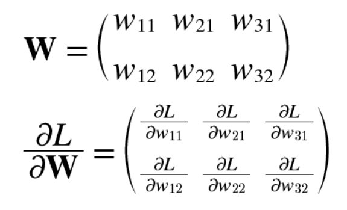

경사법을 수식으로 나타낼 때 갱신하는 양을 학습률이라고 표현한다.

즉, 한 번의 학습으로 얼마만큼 학습해야 할지를 정하는 것이 학습률이다.

경사하강법을 구현하면 아래와 같습니다.

```python
#경사하강법
def gradient_descent(f, init_x, lr=0.01, step_num=100):
    x = init_x

    for i in range(step_num):
        grad = numerical_gradient(f, x)
        x -= lr * grad
    return x
```

인수 f는 최적화하려는 함수, init_x는 초깃값, lr은 learning rate를 의미하는 학습률, step_num은 경사법에 따른 반복횟수를 뜻한다.

문제 :  경사법으로 f(x0. x1)= x0**2+x1**2 최솟값을 구하라

```python
def function_2(x):
    return x[0]**2 + x[1]**2

init_x = np.array([-3.0, 4.0])    
print(gradient_descent(function_2, init_x, lr=0.1, step_num=100))

#결과값
[-6.11110793e-10  8.14814391e-10]
```

결과값이 거의 0에 수렴하는 결과값입니다.

반대로 잘못 학습한 경우입니다.

- 학습률이 너무 큰 예 : lr = 10.0

```python
def function_2(x):
    return x[0]**2 + x[1]**2

init_x = np.array([-3.0, 4.0])    
print(gradient_descent(function_2, init_x, lr=10.0, step_num=100))

#결과값
[-2.58983747e+13 -1.29524862e+12]
```

- 학습률이 너무 작은 예 : lr = 1e-10

```python
def function_2(x):
    return x[0]**2 + x[1]**2

init_x = np.array([-3.0, 4.0])    
print(gradient_descent(function_2, init_x, lr=1e-10, step_num=100))

#결과값
[-2.99999994  3.99999992]
```

- Note

    **하이퍼파라미터**: 사람이 직접 설정해야 하는 매개변수

## 4.2 신경망에서의 기울기

신경망 학습에서의 기울기는 가중치 매개변수에 대한 손실 함수의 기울기이다. 

**가중치가 W, 손실 함수가 L**인 신경망 경우 편미분을 한다.

**손실 함수 L**이 얼마나 변하는지에 대해서 알려주는 것이 w11이다.

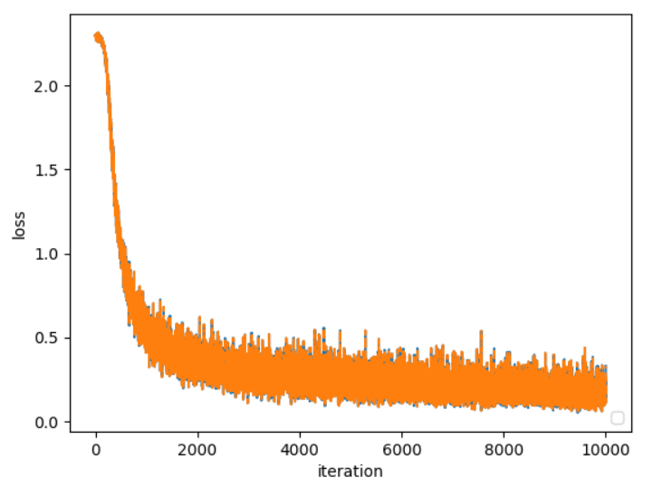

기울기를 구하는 코드를 구현하면 아래와 같습니다.

```python
import sys, os
sys.path.append(os.pardir) 
import numpy as np
from common.functions import softmax, cross_entropy_error
from common.gradient import numerical_gradient

class simpleNet:
    def __init__(self):
        self.W = np.random.randn(2,3)

    def predict(self, x):
        return np.dot(x, self.W)

    def loss(self, x, t):
        z = self.predict(x)
        y = softmax(z)
        loss = cross_entropy_error(y, t)

        return loss

x = np.array([0.6, 0.9])
t = np.array([0, 0, 1])

net = simpleNet()

f = lambda w: net.loss(x, t)

dW = numerical_gradient(f, net.W)

print(dW)

#결과값
[[ 0.2281813   0.17987652 -0.40805783]
 [ 0.34227195  0.26981479 -0.61208674]]
```

# 5. 학습 알고리즘 구현하기

> 전체

 신경망에는 적응 가능한 가중치와 편향이 있고, 이 가중치와 편향을 훈련 데이터에 적응하도록 조정하는 과정을 학습이라 한다.

- 1단계-미니배치

훈련 데이터 중 일부를 무작위로 가져온다. 미니배치의 손실 함수 값을 줄이는 것이 목표이다.

- 2단계-기울기 산출

미니배치의 손실 함수 값을 줄이기 위해 각 가주이 매개변수의 기울기를 구한다. 기울기는 손실 함수의 값을 가장 작게 하는 방향을 제시한다.

- 3단계-매개변수 갱신

가중치 매개변수를 기울기 방향으로 아주 조금 갱신한다.

- 4단계

    1~3단계를 반복한다.

하강법으로 매개변수를 갱신하는 방법이며 이때 데이터를 미니배치로 무작위로 선정하기 때문에 **확률적 경사 하강법**이라 부른다.

## 5.1 2층 신경망 클래스 구현하기

클래스의 이름은 TwoLayerNet이다.

```python
import sys, os
sys.path.append(os.pardir)  
from common.functions import *
from common.gradient import numerical_gradient
import numpy as np

class TwoLayerNet:

    def __init__(self, input_size, hidden_size, output_size, weight_init_std=0.01):

        self.params = {}
        self.params['W1'] = weight_init_std * np.random.randn(input_size, hidden_size)
        self.params['b1'] = np.zeros(hidden_size)
        self.params['W2'] = weight_init_std * np.random.randn(hidden_size, output_size)
        self.params['b2'] = np.zeros(output_size)

    def predict(self, x):
        W1, W2 = self.params['W1'], self.params['W2']
        b1, b2 = self.params['b1'], self.params['b2']
    
        a1 = np.dot(x, W1) + b1
        z1 = sigmoid(a1)
        a2 = np.dot(z1, W2) + b2
        y = softmax(a2)
        
        return y
        

    def loss(self, x, t):
        y = self.predict(x)
        
        return cross_entropy_error(y, t)
    
    def accuracy(self, x, t):
        y = self.predict(x)
        y = np.argmax(y, axis=1)
        t = np.argmax(t, axis=1)
        
        accuracy = np.sum(y == t) / float(x.shape[0])
        return accuracy

    def numerical_gradient(self, x, t):
        loss_W = lambda W: self.loss(x, t)
        
        grads = {}
        grads['W1'] = numerical_gradient(loss_W, self.params['W1'])
        grads['b1'] = numerical_gradient(loss_W, self.params['b1'])
        grads['W2'] = numerical_gradient(loss_W, self.params['W2'])
        grads['b2'] = numerical_gradient(loss_W, self.params['b2'])
        
        return grads
        
    def gradient(self, x, t):
        W1, W2 = self.params['W1'], self.params['W2']
        b1, b2 = self.params['b1'], self.params['b2']
        grads = {}
        
        batch_num = x.shape[0]
        
        # forward
        a1 = np.dot(x, W1) + b1
        z1 = sigmoid(a1)
        a2 = np.dot(z1, W2) + b2
        y = softmax(a2)
        
        # backward
        dy = (y - t) / batch_num
        grads['W2'] = np.dot(z1.T, dy)
        grads['b2'] = np.sum(dy, axis=0)
        
        dz1 = np.dot(dy, W2.T)
        da1 = sigmoid_grad(a1) * dz1
        grads['W1'] = np.dot(x.T, da1)
        grads['b1'] = np.sum(da1, axis=0)

        return grads
```

## 5.2 미니배치 학습 구현하기

미니배치 학습이란 훈련 데이터 중 일부를 무작위로 꺼내고, 그 미니배치에 대해서 경사법으로 매개변수를 갱신하는 것이다. TwoLayerNet으로 학습을 수행해본다.

```python
import numpy as np
from dataset.mnist import load_mnist

class TwoLayerNet:

    def __init__(self, input_size, hidden_size, output_size, weight_init_std=0.01):
  
        self.params = {}
        self.params['W1'] = weight_init_std * np.random.randn(input_size, hidden_size)
        self.params['b1'] = np.zeros(hidden_size)
        self.params['W2'] = weight_init_std * np.random.randn(hidden_size, output_size)
        self.params['b2'] = np.zeros(output_size)

    def predict(self, x):
        W1, W2 = self.params['W1'], self.params['W2']
        b1, b2 = self.params['b1'], self.params['b2']
    
        a1 = np.dot(x, W1) + b1
        z1 = sigmoid(a1)
        a2 = np.dot(z1, W2) + b2
        y = softmax(a2)
        
        return y
        

    def loss(self, x, t):
        y = self.predict(x)
        
        return cross_entropy_error(y, t)
    
    def accuracy(self, x, t):
        y = self.predict(x)
        y = np.argmax(y, axis=1)
        t = np.argmax(t, axis=1)
        
        accuracy = np.sum(y == t) / float(x.shape[0])
        return accuracy

    def numerical_gradient(self, x, t):
        loss_W = lambda W: self.loss(x, t)
        
        grads = {}
        grads['W1'] = numerical_gradient(loss_W, self.params['W1'])
        grads['b1'] = numerical_gradient(loss_W, self.params['b1'])
        grads['W2'] = numerical_gradient(loss_W, self.params['W2'])
        grads['b2'] = numerical_gradient(loss_W, self.params['b2'])
        
        return grads
        
    def gradient(self, x, t):
        W1, W2 = self.params['W1'], self.params['W2']
        b1, b2 = self.params['b1'], self.params['b2']
        grads = {}
        
        batch_num = x.shape[0]
        
        # forward
        a1 = np.dot(x, W1) + b1
        z1 = sigmoid(a1)
        a2 = np.dot(z1, W2) + b2
        y = softmax(a2)
        
        # backward
        dy = (y - t) / batch_num
        grads['W2'] = np.dot(z1.T, dy)
        grads['b2'] = np.sum(dy, axis=0)
        
        dz1 = np.dot(dy, W2.T)
        da1 = sigmoid_grad(a1) * dz1
        grads['W1'] = np.dot(x.T, da1)
        grads['b1'] = np.sum(da1, axis=0)

        return grads

# 시작
(x_train, t_train), (x_test, t_test) = load_mnist(normalize=True, one_hot_label=True)

network = TwoLayerNet(input_size=784, hidden_size=50, output_size=10)

iters_num = 10000  #반복횟수
train_size = x_train.shape[0]
batch_size = 100
learning_rate = 0.1

train_loss_list = []

iter_per_epoch = max(train_size / batch_size, 1)

for i in range(iters_num):
    # 미니배치 획득
    batch_mask = np.random.choice(train_size, batch_size)
    x_batch = x_train[batch_mask]
    t_batch = t_train[batch_mask]
    
    #기울기 계산
    #grad = network.numerical_gradient(x_batch, t_batch) #성능 개선판@
    grad = network.gradient(x_batch, t_batch)
    
    #매개변수 갱신
    for key in ('W1', 'b1', 'W2', 'b2'):
        network.params[key] -= learning_rate * grad[key]

    #학습결과 기록
    loss = network.loss(x_batch, t_batch)
    train_loss_list.append(loss)
```

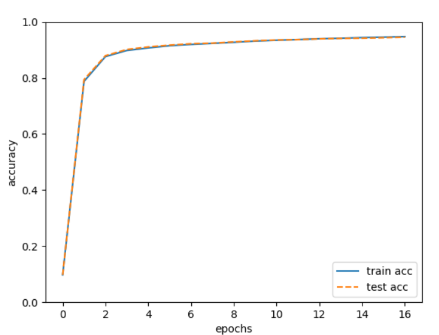

위 코드를 통해 신경망의 가중치 매개변수가 학습 횟수가 늘어가면서 손실 함수의 값이 줄어드는 것을 확인할 수 있다.

 즉, 신경망의 가중치 매개변수가 데이터를 반복해서 학습함으로서 최적 가중치 매개변수로 서서히 다가서고 있다.

## 5.3 시험 데이터로 평가하기

- epoch: 하나의 단위

    1epoch은 학습에서 훈련 데이터를 모두 소진 했을 때의 횟수에 해당 합니다.

    예를들어 훈련 데이터 10000개를 100개의 미니배치로 학습할경우 확률적 경사 하강법을 100회 반복하면 모든 훈련데이터를 소진한게 됩니다. 이 경우 100회가 1에폭이 됩니다.

신경망 학습의 목표는 범용적인 능력을 익히는 것이다. 오버피팅 일으키지 않는지 확인해야한다

. 아래는 평가하기 위한 코드이다.

```python
import sys, os
sys.path.append(os.pardir)  
import numpy as np
import matplotlib.pyplot as plt
from dataset.mnist import load_mnist
from two_layer_net import TwoLayerNet

(x_train, t_train), (x_test, t_test) = load_mnist(normalize=True, one_hot_label=True)

network = TwoLayerNet(input_size=784, hidden_size=50, output_size=10)

iters_num = 10000  
train_size = x_train.shape[0]
batch_size = 100
learning_rate = 0.1

train_loss_list = []
train_acc_list = []
test_acc_list = []

iter_per_epoch = max(train_size / batch_size, 1)

for i in range(iters_num):
		#미니배치 획득
    batch_mask = np.random.choice(train_size, batch_size)
    x_batch = x_train[batch_mask]
    t_batch = t_train[batch_mask]
    
    #기울기 계산
    #grad = network.numerical_gradient(x_batch, t_batch) #성능개선판
    grad = network.gradient(x_batch, t_batch)
    
		#매개변수 갱신
    for key in ('W1', 'b1', 'W2', 'b2'):
        network.params[key] -= learning_rate * grad[key]
    #학습경과기록
    loss = network.loss(x_batch, t_batch)
    train_loss_list.append(loss)
    
    if i % iter_per_epoch == 0:
        train_acc = network.accuracy(x_train, t_train)
        test_acc = network.accuracy(x_test, t_test)
        train_acc_list.append(train_acc)
        test_acc_list.append(test_acc)
        print("train acc, test acc | " + str(train_acc) + ", " + str(test_acc))

markers = {'train': 'o', 'test': 's'}
x = np.arange(len(train_acc_list))
plt.plot(x, train_acc_list, label='train acc')
plt.plot(x, test_acc_list, label='test acc', linestyle='--')
plt.xlabel("epochs")
plt.ylabel("accuracy")
plt.ylim(0, 1.0)
plt.legend(loc='lower right')
plt.show()

#결과값
train acc, test acc | 0.09751666666666667, 0.0974
train acc, test acc | 0.7877333333333333, 0.7941
train acc, test acc | 0.876, 0.8794
train acc, test acc | 0.8978666666666667, 0.9015
train acc, test acc | 0.9069166666666667, 0.9106
train acc, test acc | 0.9148666666666667, 0.917
train acc, test acc | 0.9193666666666667, 0.922
train acc, test acc | 0.92325, 0.924
train acc, test acc | 0.9270166666666667, 0.9286
train acc, test acc | 0.93135, 0.9325
train acc, test acc | 0.9344666666666667, 0.9352
train acc, test acc | 0.93685, 0.9367
train acc, test acc | 0.9397166666666666, 0.9392
train acc, test acc | 0.9416166666666667, 0.9409
train acc, test acc | 0.9438833333333333, 0.9417
train acc, test acc | 0.9454333333333333, 0.9434
train acc, test acc | 0.9475166666666667, 0.9451
```

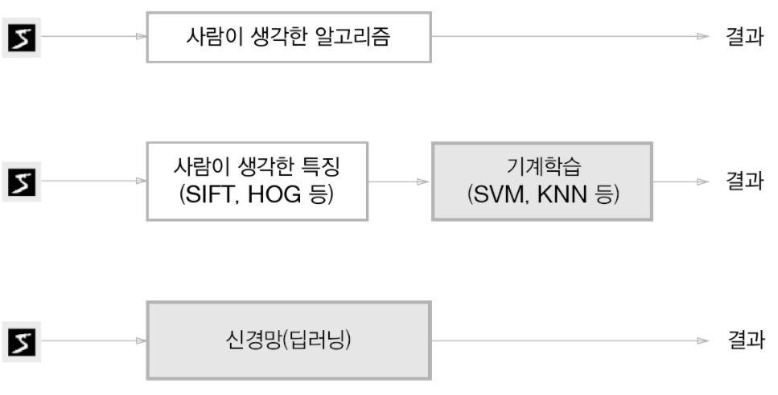

train 과 test간의 간격이 없으므로 오버피팅이 일어나지 않았다.

# 6. 정리

- 기계학습에서 사용하는 데이터셋은 훈련 데이터와 시험 데이터로 나눠 사용한다
- 훈련 데이터로 학습한 모델의 범용 능력을 시험 데이터로 평가한다.
- 신경망 학습은 손실 함수를 지표로, 손실 함수의 값이 작아지는 방향으로 가중치 매개변수를 갱신한다.
- 가중치 매개변수를 갱신할 때는 가중치 매개변수의 기울기를 이용하고, 기울어진 방향으로 가중치의 값을 갱신하는 작업을 반복한다.
- 아주 작은 값을 주었을 떄의 차분으로 미분하는 것을 수치 미분이라고 한다.
- 수치 미분을 이용해 가중치 매개변수의 기울기를 구할 수 있다.
- 수치 미분을 이용한 계산에는 시간이 걸리지만, 그 구현은 간단하다. 한편, 다음 장에서 구현하는 (다소 복잡한) 오차역전파법은 기울기를 고속으로 구할 수 있다.