# CHAPTER 6 학습 관련 기술들

# 1. 매개변수 갱신

신경망 학습의 목적은 항상 '손실 함수의 값을 가능한 낮추는 매개변수를 찾는 것'이 목표이다.

이를 위해서 매개변수의 기울기를 이용하였고, 갱신한 매개 변수 값으로 다시 갱신하고,갱신하는 방법을 취했다. 이러한 것을 SGD, 확률적 경사 하강법이라고 한다.

## 1.2 확률적 경사 하강법(SGD)

확률적 경사 하강법이란 간단히 말하면, 기울어진 방향으로 일정 거리만큼 가겠다는 방법이다.

수식은 다음과 같다.

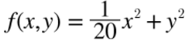

```python
class SGD:
	def __init__(self, lr=0.01):
		self.lr = lr
	def update(self, params, grads):
		for key in params.keys():
			params[key] -= self.lr*grads[key]
```

단순하고 구현도 쉽지만, 비효율적일 때가 있다. 비등방성 함수( 방향에 따라 기울기가 달라지는 함수) 에서는 탐색 경로가 비효율적이다. SGD는 무작정 기울어진 방향으로 진행하고, 기울어진 방향이 본래의 최솟값과는 다른 방향을 가르킨다. 이러한 단점을 개선시켜주는 다른 방법을 설명하겠다.

## 1.3 SGD의 단점

SGD는 단순하고 구현도 쉽지만 문제가 있다. 다음예시를 보자

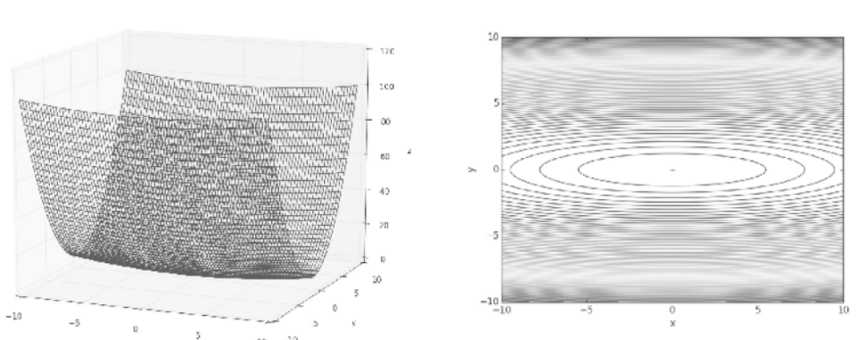


기울기는 다음과 같다.

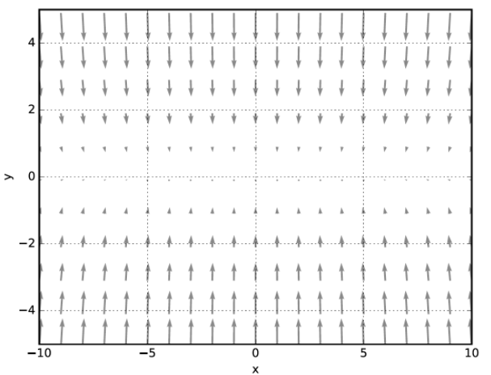

위 식이 최솟값이 되는 장소는 (x, y) = (0, 0) 인데, 기울기의 대부분은 (0, 0) 방향을 가리키고 있지 않다. 초기값(x, y) = (-7.0, 2.0)에서 SGD를 적용하면 다음 그림의 경로를 따른다.

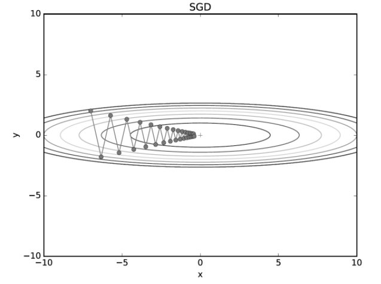


지그재그로 한참을 가게 되는데, 굉장히 비효율적임을 알 수 있다.

책에서는 이러한 단점을 해결하기 위한 방법으로 모멘텀, AdaGrad, Adam을 소개한다.

## 1.4 모멘텀

모멘텀은 '운동량'을 뜻하는 단어로, 물리와 관계가 있다. 수식은 다음과 같다.

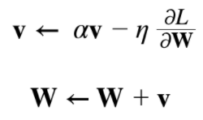

새로 등장한 v 변수는 속도로, 기울기 방향으로 힘을 받아 물체가 지속된다는 물리법칙을 나타낸다.

- av항은 물체가 아무런 힘을 받지 않을 때 서서히 하강하는 역할을 하고 a는 0.9(지면마찰, 공기저항)등의 값으로 설정합니다

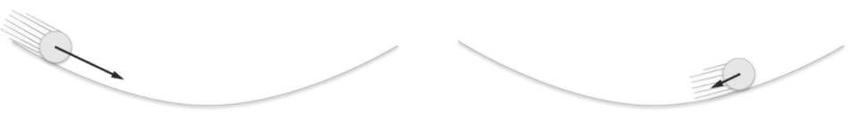

```python
class Momentum:
	def __init__(self, lr=0.01, momentum = 0.9):
		self.lr = lr
		self.momentum = momentum
		self.v = None
	
	def update(self, params, grads):
		if self.v is None:
			self.v = {}
			for key, val in params.items():
				self.v[key] = np.zeros_like(val) # val 크기의 0 행렬 생성
			
		for key in params.keys():
			self.v[key] = self.momentum*self.v[key] - self.lr*grads[key]
			params[key] += self.v[key]
```

momentum이 a에 해당한다. v는 초기화 떄는 아무값도 담지 않고, 대신 update()가 처음 호출 될 때 매개변수와 같은 구조의 데이터를 딕셔너리 변수로 저장한다.

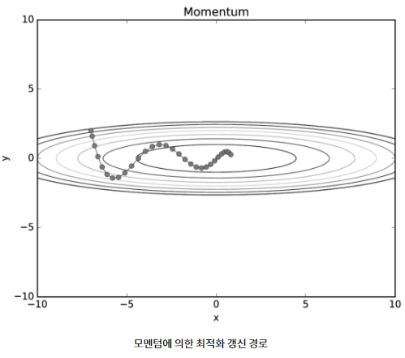

 x축의 힘은 작지만 방향이 변하지 않아 한 방향으로 일정하게 가속하고 y축의 힘은 크지만 방향이 변해 위아래로 상충하여 방향과 속도가 일정치 않다. SGD 보다 x축 방향으로 빠르게 다가간다.

## 1.5 AdaGrad

신경망 학습에서 학습률(n)이 중요하다. 너무 크면 발산하고, 너무 작으면 학습 시간이 너무 길어지기 때문이다. 이 학습률을 정하는 기술로 **학습률 감소**가 있다. 

이는 학습을 진행 하면서 학습률을 점차 줄여가는 방법을 말하는데, 학습률을 서서히 낮추는 가장 간단한 방법은 매개변수 전체의 학습률 값을 일괄적으로 낮추는 것인데, 이를 발전시킨 것이 AdaGrad인 것이다. 

AdaGrad는 **각각의 매개변수**에 적응적으로 학습률을 조정 하면서 학습을 진행한다. 수식을 다음과 같다.

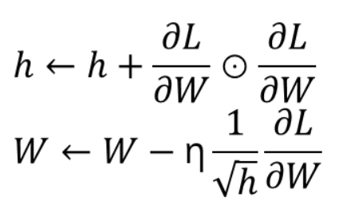

h라는 새로운 변수는 기존 기울기 값을 제곱하여 계속 더해준다. 그리고 매개변수를 갱신할 때 1/sqrt(h) 를 곱해 학습률을 조정한다.

 즉, 매개변수의 원소중 많이 움직인 원소는 학습률이 낮아진다. 즉, 학습률 감소가 매개변수의 원소마다 다르게 적용됨을 뜻한다.

```python
class AdaGrad:
	def __init__(self, lr=0.01):
		self.lr = lr
		self.h = None
	
	def update(self, params, grads):
		if self.h is None:
			self.h = {}
			for key, val in params.items():
				self.h[key] = np.zeros_list(val)
		
			for key in params.keys():
				self.h[key] += grads[key]*grads[keys]
				params[key] -= self.lr*grads[key]/(np.sqrt(self.h[key])+1e-7)# 1e-7: divide by zero 방지

```

> AdaGrad는 학습을 진행할수록 갱신강도가 약해져 어느순간 갱신량이 0이되어 전혀 갱신되지 않는다. 이문제를 해결하기 위해서 RMSProp이라는 방법이 있는데 이는 먼 과거의 기울기는 잊고, 새로운 기울기 정보를 반영하는 식이다. 이를 지수이동평균,EMA)이라 하여, 과거 기울기 반영규모를 기하급수적으로 감소시킨다.)

- RMSProp

    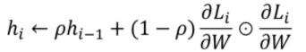

RMSProp는 기울기를 단순 누적하지 않고 지수 가중 이동 평균 을 사용하여 최신 기울기들이 더 크게 반영되도록 하였다.

이전 AdaGrad의 h에 새로운 하이퍼파라미터 p를 추가하여 p가 작을수록 가장 최신의 기울기를 더 크게 반영하게된다.

## 1.6 Adam

Adam은 모멘텀과 AdaGrad를 융합한 기법이다. AdaGrad는 매개변수의 원소마다 적응적으로 갱신정도를 조정했고, 모멘텀은 속도를 가중치로 적용했다. 이 방법은 매개변수의 공간을 효율적으로 탐색해주고, 하이퍼파라미터의 **편향보정**이 진행된다는 점도 특징이다.

다음 사진은 지금까지 알아본 최적화 기법의 갱신 경로를 비교한 것이다.


## 1.7 어느 갱신 방법을 이용할 것인가?

 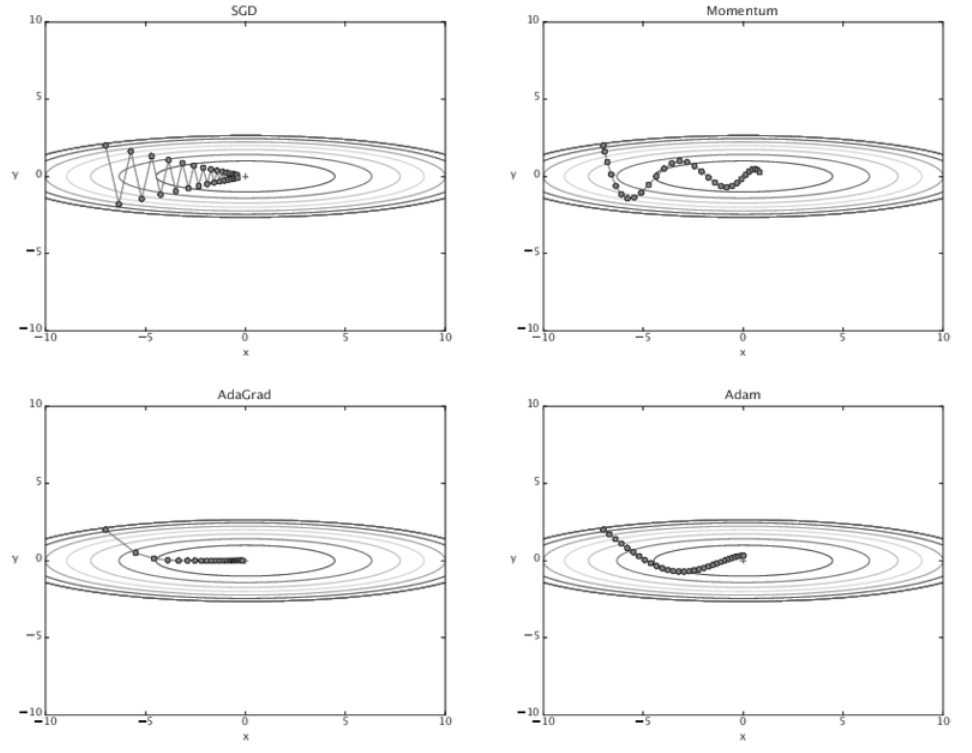


그림만 봐서는 AdaGrad가 가장좋은것 같지만 각 방법이 각각 장단이 있어 잘 푸는 문제가 있고 아닌 문제가 있다. 책에서는 많은 사람들이 Adam을 사용한다고 한다.

## 1.8 MNIST 데이터셋으로 본 갱신 방법 비교

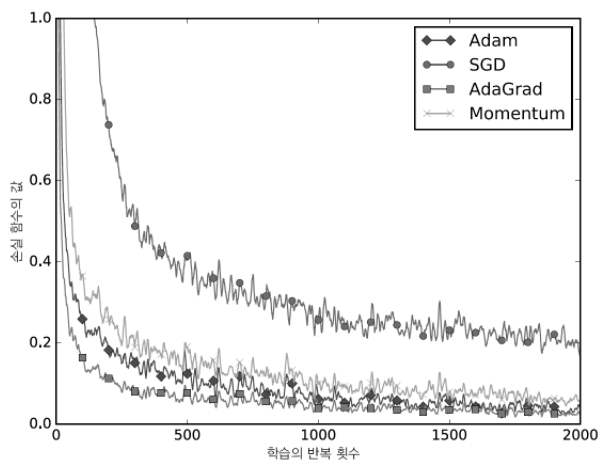

위 실험에서는 각 층이 100개의 뉴런으로 구성된 5층 신경망에서 ReLU를 활성화 함수로 사용해 측정했다.

일반적으로 SGD보다 다른 세 기법이 빠르게 학습하고, 때로는 최종 정확도 역시 높게 나타난다고 한다.

# 2. 가중치의 초기값

신경망 학습에서 중요한 것이 가중치 초기값이다. 따라서 권장 초기값에 대해 알아보고 실험을 통해 확인해본다.

## 2.1 초기값을 0으로 하면?

- **초기값을 모두 0 으로 설정한다면?**
    - 학습이 올바르게 이뤄지지 않음
    - 오차역전파법에서 모든 가중치의 값이 똑같이 갱신되기 때문
    - 역전파 과정에서 update가 동일하게 이루어지며, 반복적으로 일어남
    - 가중치를 여러 개 갖는 의미를 사라지게 함


- **가중치감소**
    - 가중치 매개변수의 값이 작아지도록 학습
    - 가중치 값을 작게 하여 오버피팅이 일어나지 않게함
    - 최대한 작은 값에서 시작

## 2.2 은닉층의 활성화값 분포

이번에는 가중치의 초기값에 따라 은닉층 활성화 값들이 어떻게 변하는지 확인해보자.

스탠터드 대학의 수업을 참고, 활성화 함수로 **시그모이드 함수를 사용**하는 5층 신경망에 무작위로 생성한 입력데이터를 흘리며 각 층의 활성화값 분포를 히스토그램으로 그려본 실험에 의거해 설명해보면

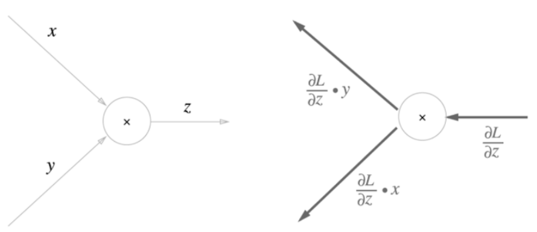

**case 1: 정규분포/시그모이드**

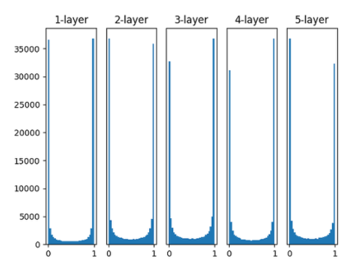

가중치의 분포를 보면 각 층의 활성화 값들이 0과 1에 치우쳐 분포되어 있는 것을 볼 수 있다.

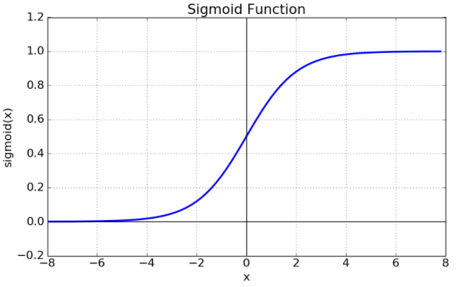

시그모이드 함수는 출력이 0 에 가까워지면 미분이 0에 다가가기 때문에, 역전파의 기울기 값이 점점 사라져 기울기 손실을 유발한다고 알려져 있다.

**가중치의 표준편차를 0.01**로 바꿔주면,

**case 2: 정규분포*0.01/시그모이드**

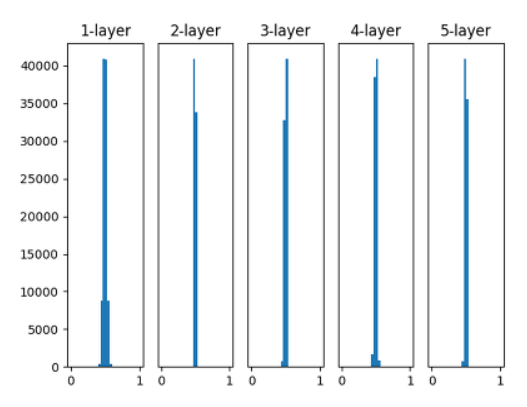

이번에는 0.5 부근에 집중되어 있다. 

앞서 본 그림처럼 0과 1로 치우쳐지지는 않아 기울기 소실 문제는 없으나, 활성화 값들이 치우쳐졌다는것은 다수의 뉴런이 거의 같은 값을 출력하고 있으니 뉴런을 여러개 둔 의미가 없어지게 된다는 의미다. 그래서, 이는 표현력 제한 관점에서 문제가 된다.

다음으로는 sqrt(1/n)인 정규분포, **Xavier 초기값**을 사용한 결과다.

**case 3:  Xavier 초기값/시그모이드**

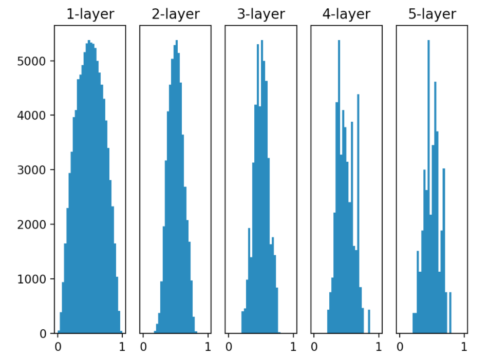

결과를 보면 층이 깊어질 수록 형태가 일그러지긴 하지만, 뉴런들이 확실히 넓게 분포됨을 알 수 있다. 따라서 각 층에 흐르는 데이터가 적당히 퍼져있으므로, 시그모이드 함수의 표현력도 제한받지 않고 학습이 효율적으로 이루어질것으로 예상된다.

Xavier 초기값은 일반적인 딥러닝 프레임워크들이 표준적으로 이용하고 있다.

이 초기값은 각 층의 활성화값들을 광범위하게 분포시킬 목적으로 가중치의 적절한 분포를 찾았다.

앞 계층의 노드가 n개라면 표준편차가 1/sqrt(n) 인 분포를 사용하면 된다.

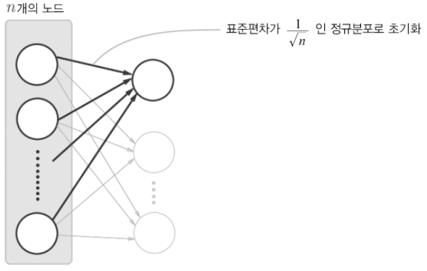

```python
node_num = 100 # 앞층의 노드수
w = np.random.randn(node_num, node_num) * np.sqrt(1.0/node_num)
```

## 2.3 ReLU를 사용할 때의 가중치 초기값

시그모이드 함수와 tanh 함수는 좌우대칭, 중앙부근이 선형인 함수로, Xavier 초기값이 적당하다. 반면 ReLU를 이용할때는 ReLU에 특화된 초기값을 이용해야 한다.  바로, He 초기값이라고 한다.

He 초기값은 앞 층의 노드가 n 개 일 때 sqrt(2/n)인 정규분포를 사용한다.

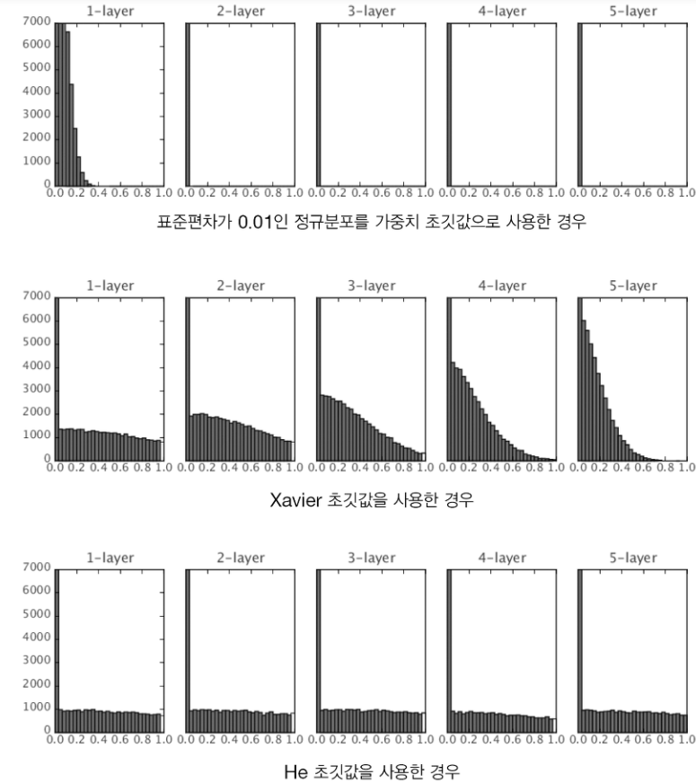


표준편차가 0.01일 때는 각 층의 활성화 값들이 매우 작다. 이렇게 작은 데이터들이 흐른다는 것은 역전파때 가중치의 기울기가 작아진다는 뜻이며, 이렇게 되면 학습이 거이 이루어지지않는다.

Xavier 초기값의 결과를 보면 치우침이 조금씩 커지며 이는 기울기 소실 문제를 일으킨다. 

마지막으로 He초기값은 모든층에 균일하게 분포되어 역전파때도 적절한 값이 나올것으로 기대할 수 있다.

> 결론

활성화 함수로 ReLU를 사용할 때는 He초기값

sigmoid나 tanh 함수 들의 S자 모양 곡선일때는 Xavier 초기값 

## 2.4 MNIST 데이터셋으로 본 가중치 초기값 비교

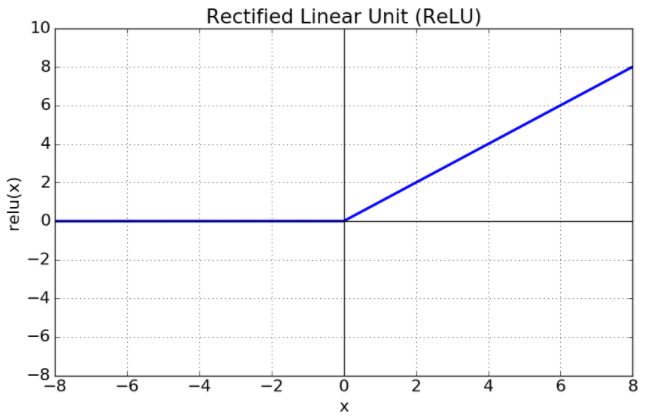

층별 뉴런이 100개인 5층 신경망에서 활성화 함수로 ReLU를 사용했다.

# 3. 배치 정규화

앞서 가중치의 초기값을 적절히 설정해 각 층의 활성화 값 분포가 적당히 퍼지면 학습이 원활히 된다고 했는데, 배치 정규화는 각 층이 활성화값을 적당히 퍼뜨리도록 강제하는 아이디어에서 나왔다.

## 3.1 배치 정규화 알고리즘

배치 정규화 방법이 즐겨 사용되는 이유는 다음과 같다.

- 학습을 빨리 진행할 수 있다.
- 초기값에 크게 의존하지 않는다.
- 오퍼피팅을 억제한다.(드롭아웃의 필요성 감소)

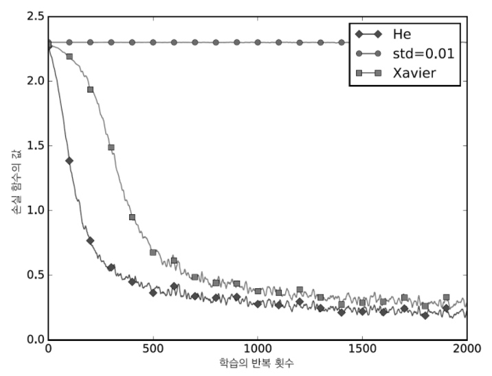

배치 정규화는 각 층에서의 활성화 값이 적당히 분포되도록 조정한다. 

우선 배치 정규화게층을 신경망에 삽입하는 것으로 시작한다. 

이 층에서는 학습 시 미니배치를 단위로 데이터 분포가 정규분포(평균이 0, 분산이 1)이 되도록 정규화한다. 

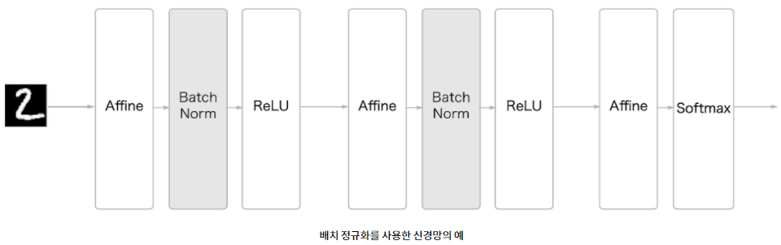

평균이 0 검증

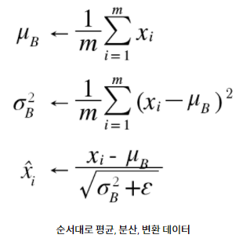

분산이 1 검증

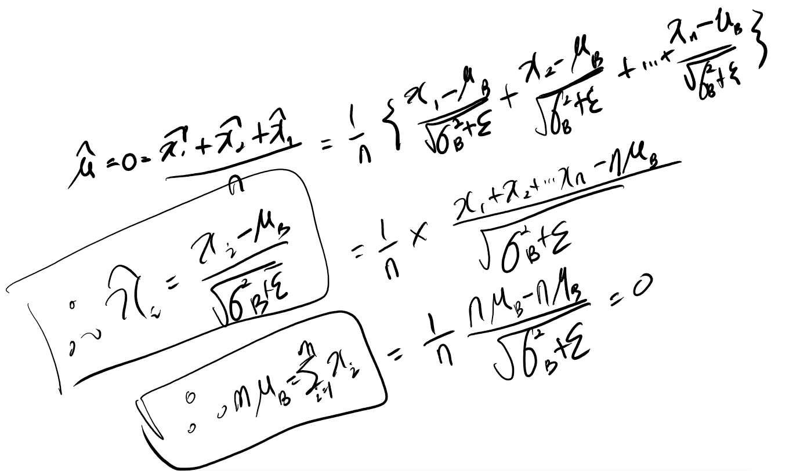

ε은 아주 작은 값으로 divide by zero를 막기 위함이다.

배치 정규화 계층마다 이 정규화된 데이터에 고유한 확대(scale)와 이동(shift)변환을 수행한다.

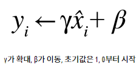

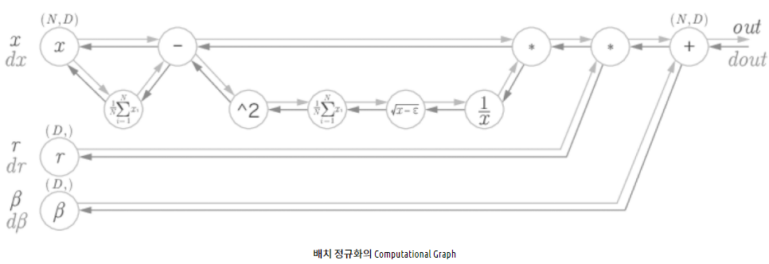

## 3.2 배치 정규화의 효과

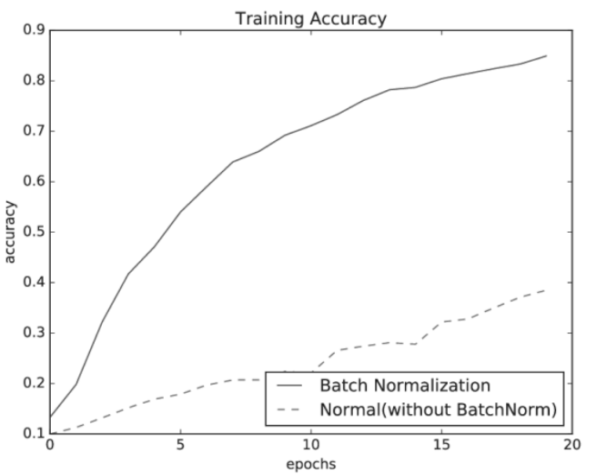

배치 정규화시 더 빠른 것을 알 수 있다.

# 4. 바른 학습을 위해

기계학습에서 오버피팅이 문제가 되는 일이 많다 오버피팅이란 신경망이 훈련데이터에만 지나치게 적응되어 그외의 데이터는 제대로 대응하지 못하는 상태를 말한다. 기계학습은 범용성을 지향하기 때문에 학습된 데이터 이외에 새로운 데이터가 들어 왔을 때 식별해내는 모델이 바람직하다. 따라서 오버피팅을 줄이는 것이 매우 중요하다.

## 4.1 오버피팅

오버피팅은 주로 다음과 같은 경우에 일어난다.

- 매개변수가 많고 표현력이 높은 모델
- 훈련데이터가 적음

오버피팅을 억제하기 위해 주로 이용하는 방법

- 가중치 감소
- 드롭아웃

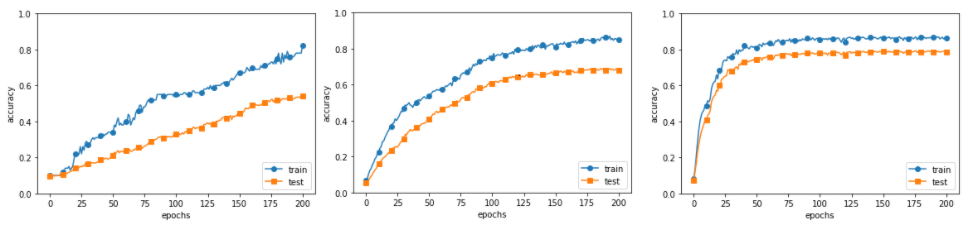

각각 앞에서부터 100개, 300개, 1000개이다. 데이터수가 적을수록 훈련 데이터와 시험 데이터의 간극이 커지는 것을 확인할 수 있다.

## 4.2 가중치감소

가중치 감소는, 학습과정에서 큰 가중치에 대해 그에 상응하는 큰 패널티를 부과하여 오버피팅을 억제하는 방법이다. 손실함수의 가중치에 L2 Norm(각 원소의 제곱들을 더해서 루트를 씌운 값)을 더한 가중치 감소 방법이다.

[https://mirae-kim.tistory.com/7](https://mirae-kim.tistory.com/7)

## 4.3 드롭아웃

드롭아웃은 뉴런을 임의로 삭제하면서 학습하는 방법이다. 훈련 때 은닉층을 무작위로 골라 삭제한다.(매번 다른 모델을 학습시킨다.) 시험 때는 모든 뉴런에 신호를 전달한다. 단, 시험때는 각 뉴런의 출력에 훈련 때 삭제한 비율을 곱하여 출력한다.(모델의 평균을 내는 것과 비슷한 효과)

# 5. 적절한 하이퍼파라미터 값 찾기

신경망에서 등장하는 하이퍼파라미터는 각 층의 뉴런 수, 배치크기, 매개변수 갱신 시의 학습률과 가중치 감소 등을 말한다. 이러한 하이퍼파라미터 값은 모델의 성능에 있어서 매우 중요하다. 따라서, 하이퍼 파라미터의 값을 최대한 효율적으로 탐색하는 방법을 알아보자.

## 5.1 검증 데이터

지금까지 데이터셋을 훈련데이터와 시험데이터라는 두가지로 분리해 이용했다. 훈련데이터로 학습하고, 시험데이터로 범용 성능을 평가한다. 주의할 점은 하이퍼파라미터의 성능을 평가할 때는 시험 데이터를 사용해서는 안된다. 이유는 시험 데이터를 사용하여 하이퍼 파라미터가 조정되면 하이퍼파라미터 값이 시험데이터에 오버피팅 되기 때문이다. 따라서 하이퍼파라미터를 조정할 때에는 전용 확인 데이터가 필요하다 이런 하이퍼파라미터의 적절성을 평가하는 데이터를 검증데이터라고 부른다.

- 훈련데이터: 매개변수 학습
- 검증데이터: 하이퍼파라미터 성능 평가
- 시험데이터: 신경망의 범용 성능 평가

데이터 셋에 따라 이렇게 세 가지로 분류해 놓은 것도 있지만, 그렇지 않고 훈련데이터와 시험데이터로만 분리되어있을 경우에는 보통 훈련데이터 중 20% 정도를 검증데이터로 먼저 분리한다.

## 5.2 하이퍼파라미터 최적화

최적화 할 때 핵심은 ' 최적 값'이 존재하는 범위를 조금씩 줄여간다는 것 이다. 그러려면, 우선 대략적인 범위를 설정하고 그 범위에서 무작위로 하이퍼파라미터 값을 골라낸후(샘플링) 그 값으로 정확도를 평가한다.

> 하이퍼파라미터 최적화에서 범위는 대략적으로 0.001~1000 사이의 로그 스케일로 지정하고, 그리드 서치같은 규칙적인 탐색보다는 무작위로 샘플링해 탐색하는것이 좋다. 또한 하이퍼파라미터를 최적화 할 때는 딥러닝 학습시간이 오래걸리므로, 학습을 위한 EPOCH를 작게 하여 1회 평가에 걸리는 시간을 단축하는 것이 효과적이다.

## 5.3 하이퍼파라미터 최적화 구현하기

# 6. 정리

- 매개변수 갱신 방법에는 확률적 경사 하강법(SGD) 외에도 모멘텀, AdaGrad, Adam 등이 있다.
- 가중치 초기값을 정하는 방법은 올바른 학습을 하는데 매우 중요하다.
- 가중치의 초기값으로는 "Xavier 초기값"과 "He 초기값"이 효과적이다.
- 배치 정규화를 이용하면 학습을 빠르게 진행할 수 있으며, 초기값에 영향을 덜 받게 된다.
- 오버피팅을 억제하는 정규화 기술로는 가중치 감소와 드롭아웃이 있다.
- 하이퍼 파라미터 값 탐색은 최적 값이 존재할 법한 범위를 점차 좁히면서 하는 것이 효과적이다.