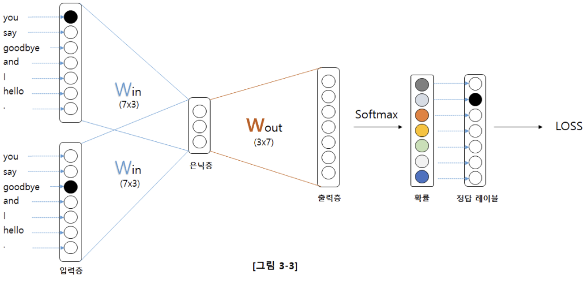
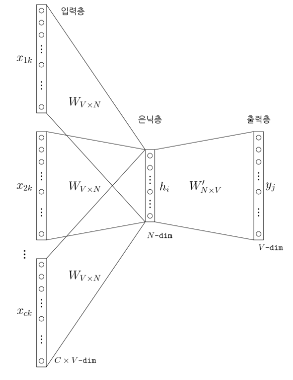
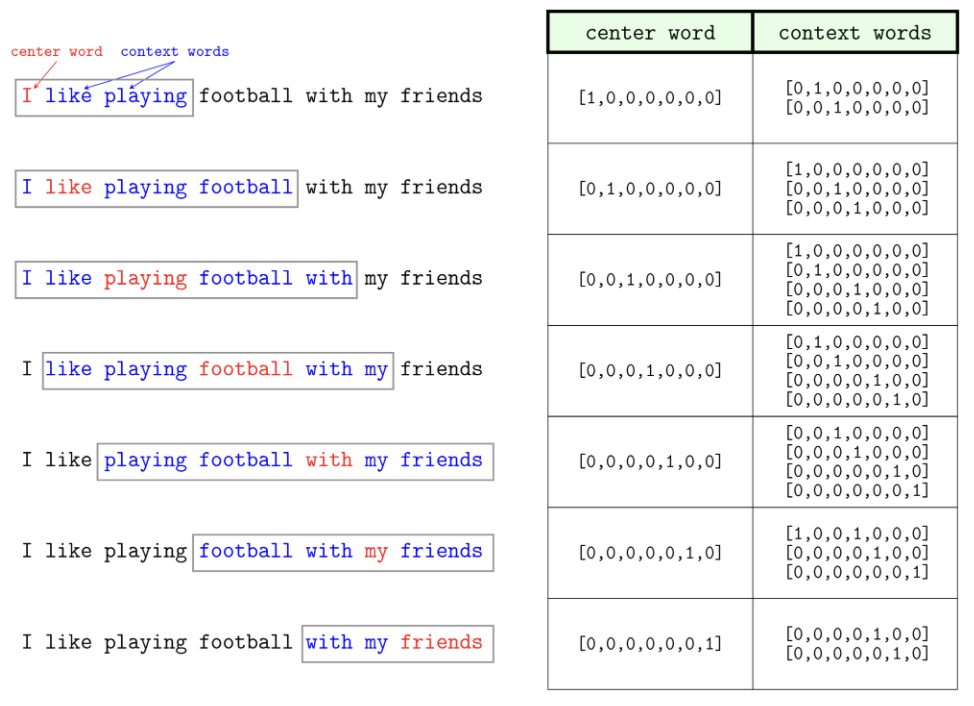
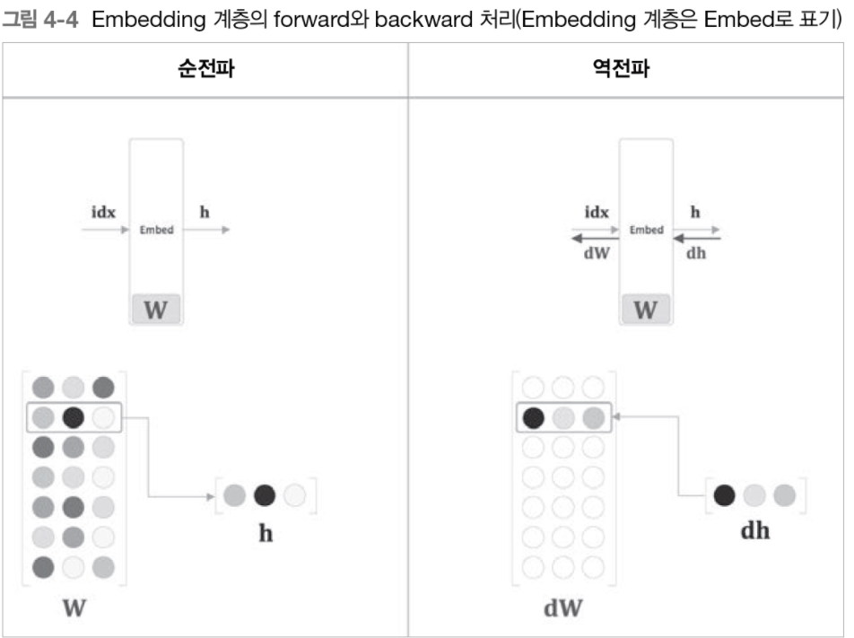
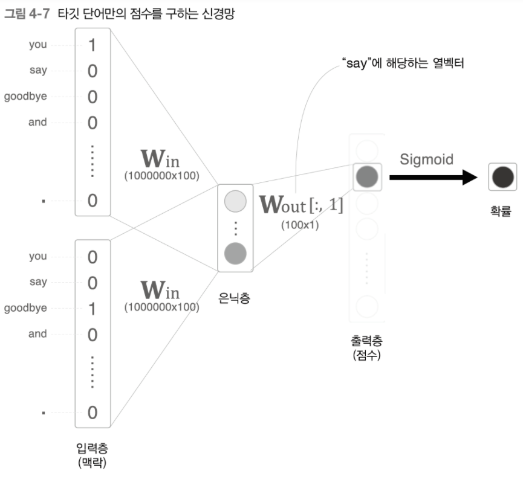
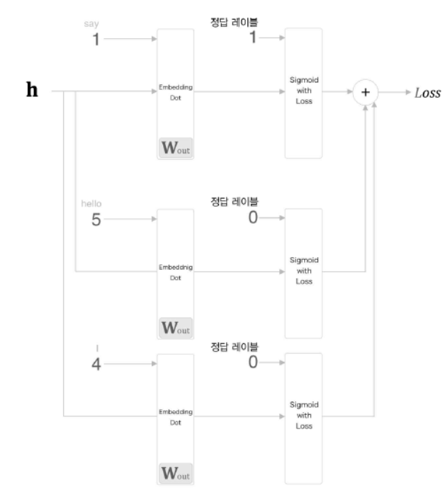
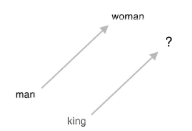
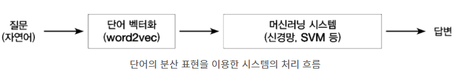

# CHAPTER 4 Word2vec 속도 개선

앞서 3장에서 보았던 CBOW 모델은 처리 효율이 떨어져 말뭉치에 포함된 어휘 수가 많아지면 계산량도 커진다. 따라서 단순한 Word2vec에 두가지 개선을 추가한다.

1. Embedding 이라는 새로운 계층을 만든다.
2. 네거티브 샘플링 이라는 새로운 손실함수를 도입한다.

CBOW 모델은 복수 단어 문맥에 대한 문제 즉, 여러개의 단어를 나열한 뒤 이와 관련된 단어를 추정하는 문제이다. 문자에서 나오는 n개의 단어 열로부터 다음 단어를 예측하는 모델이다.



입력 층 가중치와 행렬 곱으로 은닉층이 계산되고, 다시 출력층 가중치와의 행렬 곱으로 각 단어 점수를 계산 소프트맥스 함수를 적용해 각 단어의 출현 확률을 얻어 정답 레이블과 비교하여 손실을 구한다.

위의 그림은 다루는 어휘가 7개일 때인데 만약 어휘가 100만개, 은닉층의 뉴런이 100개인 CBOW모델을 생각해 보면, 입력층과 출력층에 각 100만개의 뉴런이 존재하고, 다음 두 계산이 병목된다.

1. 입력층의 원핫 표현과 가중치 행렬 Win의 곱 계산
2. 은닉층과 가중치 행렬 Wout의 곱 및 소프트맥스 계층의 계산

각각의 계산 병목 문제를 4.1과 4.2에서 해결해 본다.

# 1. Word2vec 개선 1

첫 번째 문제는 단어를 원핫으로 다루기 때문에 어휘 수가 많아지면 원핫 표현의 벡터 크기도 커진다.

예를 들어 어휘가 100만개라고 하면 그 원핫 표현 하나만 해도 원소 수가 100만개인 벡터가 되기 때문에, 상당한 메모리 차지와 원핫벡터와 가중치 행렬 Win을 곱할 때 계산 자원이 매우 낭비 된다. 

## 1.1 Enbedding 계층

Enbedding 이란 텍스트를 구성하는 하나의 단어를 수치화하는 방법의 일종이다.

텍스트 분석에서 흔히 사용하는 방식은 단어 하나에 인덱스 정수를 할당하는 Bag of Words 방법이다. 이 방법을 사용하면 문서는 단어장에 있는 단어 갯수와 같은 크기의 벡터가 되고 단어장의 각 단어가 그 문서에 나온 횟수만큼 벡터의 인덱스 위치의 숫자를 증가시킨다.

즉 단어장이 'I', 'am', 'a', 'boy', 'girl' 다섯개의 단어로 이루어진 경우 각 단어에 다음과 같이 숫자를 할당한다.

이때 'I am a girl'이라는 문서는 다음과 같이 벡터로 만들 수 있다.

```python
[1, 1, 1, 0, 1]
```

단어 임베딩은 하나의 단어를 하나의 인덱스 정수가 아니라 실수 벡터로 나타낸다. 예를 들어 2차원 임베딩을 하는 경우 다음과 같은 숫자 벡터가 될 수 있다.

```python
'I': (0.3, 0.2)
'am': (0.1, 0.8)
'a': (0.5, 0.6)
'boy': (0.2, 0.9)
'girl': (0.4, 0.7)
```

단어 임베딩이 된 경우에는 각 단어 벡터를 합치거나 더하는 방식으로 전체 문서의 벡터 표현을 구한다.

CBOW 임베딩 예시를 보면 다음과 같다.





임베딩 계층의 순전파는 가중치 W의 특정 행을 추출하는 것이다. 반대로 역전파는 앞 층(출력층)으로부터 전해진 기울기를 다음 층(입력층) 으로 그대로 흘려주면 된다. 다만 앞 층으로부터 전해진 기울기를 가중치 기울기 dW의 특정 행(idx번째 행)에 설정한다.



## 1.2 Enbedding 계층 구현

임베딩 계층의 forward()와 backward() 메서드를 구현한 코드는 다음과 같다.

```python
class Embedding:
    def __init__(self, W):
        self.params = [W]
        self.grads = [np.zeros_like(W)]
        self.idx = None

    def forward(self, idx):
        W, = self.params
        self.idx = idx
        out = W[idx]
        return out

    def backward(self, dout):
        dW, = self.grads
        dW[...] = 0
        np.add.at(dW, self.idx, dout)
        return None
```

params와 grads를 인스턴스 변수로 사용한다. idx에는 추출하는 행의 인덱스(단어 ID)를 배열로 저장한다.

# 2. Word2vec 개선 2

## 2.1 은닉층 이후 계산의 문제점

남은 병목은 은닉층 이후의 처리(행렬 곱과 softmax 계층의 계산)이다. 

이전 어휘가 100만개일때를 가정한 word2vec 모델이 있었는데 은닉층의 뉴런과 가중치 행렬의 곱을 할 때, 크기가 100인 은닉층 뉴런과 100*100인 가중치 행렬을 곱해야 하고 역전파때도 같은 계산을 수행한다.

또한 소프트맥스의 계산량도 exp계산만 100만번 수행해야 한다.

따라서

1. 은닉층의 뉴런과 가중치 행렬의 곱
2. 소프트맥스 계층의 계산

 연산 문제를 해결 해야 한다.

## 2.2. 다중 분류에서 이진 분류로

네거티브 샘플링의 핵심은 다중 분류를 이중 분류로 근사하는 것이다.

예를 들면 다중 분류는 맥락이 "you와 goodbye일 때 타깃 단어는 무엇입니까?" 에 대답하는것이고," 이진 분류는 맥락이 you와 goodbye일 때 타깃 단어는 say입니까?" 에  대답하는 것이다. 

이런식으로 하면 출력층에 뉴런을 하나만 준비하면 된다. 출력층의 이 뉴런이 say의 점수를 출력하는 것이다.



따라서 은닉층과 출력층의 가중치 행렬의 내적은 say에 해당하는 열만 추출하고 추출된 벡터와 은닉층 뉴런과의 내적을 구하면 끝이다.

## 2.3 시그모이드 함수와 교차 엔트로피 오차

이진 분류 문제를 신경망으로 풀려면 점수에 시그모이드 함수를 적용해 확률로 변환하고 손실을 구할 때는 손실함수로 교차엔트로피오차를 사용한다.

(다중 분류의 경우 출력층에서 소프트맥스 함수를 손실함수로는 교차 엔트로피 오차를 이용한다.)

- 이진 분류 - 시그모이드 적용(확률 변환) , loss - cross entropy error
- 다중 분류 - 소프트맥스 적용(확률 변환) , loss - cross entropy error

## 2.4 다중 분류에서 이진 분류로(구현)

그러면 이진분류를 수행하는 word2vec을 보자

단어 ID는 you: 0, say: 1, goodbye: 2 라고 가정하고 임베딩 계층에서 단어 ID의 분산표현을 추출하고 은닉층 뉴런 h와 출력층의 가중치 Wout에서 단어 'say에 해당하는 column을 추출해서 해당하는 단어 벡터와의 내적을 계산한다. 그리고 그 출력을 시그모이드 계층에 입력해 최종 손실을 얻는다.

```python
class EmbeddingDot:
    def __init__(self, W):
        self.embed = Embedding(W)
        self.params = self.embed.params
        self.grads = self.embed.grads
        self.cache = None

    def forward(self, h, idx):
        target_W = self.embed.forward(idx)
        out = np.sum(target_W * h, axis=1)

        self.cache = (h, target_W)
        return out

    def backward(self, dout):
        h, target_W = self.cache
        dout = dout.reshape(dout.shape[0], 1)

        dtarget_W = dout * h
        self.embed.backward(dtarget_W)
        dh = dout * target_W
        return dh
```

총 4개의 인스턴스 변수 [embed, params, grads, cache] 가 있다.

params: 매개변수 저장

grads: 기울기

emded: 임베딩 계층

cache: 순전파시의 계산결과

순전파를 담당하는 forward(h, idx)메서드는 인수로 은닉층 뉴런(h)와 단어 ID의 넘파이 배열(idx)를 받는다.

이 Enbedding 계층과 시그모이드 함수를 거쳐 긍정(1)과 부정(0)에 가깝게 결과를 출력한다.

## 2.5 네거티브 샘플링

hidden layer의 가중치 행렬 Wout의 곱의 문제점을 해결하기 위해 Softmax 대신 negative sampling을 사용

지금까지 긍정적 정답에 대해서만 학습 했었지만 부정적 정답에 대해서 sigmoid layer의 출력을 0 에 가깝게 만드는 것을 위해 부정적 정답에 대해서도 학습을 진행한다.

그런데 부정적 예는 대상으로 하는 어휘 수가 많아지면 감당할 수가 없기 때문에 근사적인 해법으로 부정적인 예를 적게 몇 개만 샘플링한다. (5개, 10개 이정도로)



정리하면 네이티브 샘플링 기법이란 긍정적 예를 타깃으로 한 경우의 손실을 구한다. 그 동시에 부정적 예 몇개 샘플링 하여 그 부정적 예에 대해서도 마찬가지로 손실을 구한다. 

그리고 각각의 데이터의 손실을 더한 값을 최종 손실로 한다.

## 2.6 네거티브 샘플링의 샘플링 기법

앞서 부정적 예를 적게 샘플링 한다고 했는데 이를 수행하는데 좋은 방법이 있다. 바로 말뭉치의 통게 데이터를 기초로 샘플링한다. 말뭉치에서 자주 등장하는 단어는 많이 추출하고, 드물게 등장하는 단어는 적게 추출한다. 

먼저, 말뭉치에서 각 단어의 출현 횟수를 구해 '확률 분포'로 나타내고, 그 확률 분포대로 단어를 샘플링을 수행하면 된다.

다음은 이를 수행하는 코드이다.

```python
class UnigramSampler:
    def __init__(self, corpus, power, sample_size):
        self.sample_size = sample_size
        self.vocab_size = None
        self.word_p = None

        counts = collections.Counter()
        for word_id in corpus:
            counts[word_id] += 1

        vocab_size = len(counts)
        self.vocab_size = vocab_size

        self.word_p = np.zeros(vocab_size)
        for i in range(vocab_size):
            self.word_p[i] = counts[i]

        self.word_p = np.power(self.word_p, power)
        self.word_p /= np.sum(self.word_p)

    def get_negative_sample(self, target):
        batch_size = target.shape[0]

        if not GPU:
            negative_sample = np.zeros((batch_size, self.sample_size), dtype=np.int32)

            for i in range(batch_size):
                p = self.word_p.copy()
                target_idx = target[i]
                p[target_idx] = 0
                p /= p.sum()
                negative_sample[i, :] = np.random.choice(self.vocab_size, size=self.sample_size, replace=False, p=p)
        else:
            # GPU(cupy）로 계산할 때는 속도를 우선한다.
            # 부정적 예에 타깃이 포함될 수 있다.
            negative_sample = np.random.choice(self.vocab_size, size=(batch_size, self.sample_size),replace=True, p=self.word_p)

        return negative_sample
```

여기에서 word2vec은 단어 빈도수를 나타내는 확률분포에서 0.75를 곱하라고 권고한다. 이는, 확률이 낮은 단어를 버리지 않기 위해서다. 0.75를 곱하면 원래 확률이 낮은 단어에서 확률을 살짝 높일 수 있다.

따라서 위의 코드는 말뭉치에서 확률분포를 만들고 다시 0.75를 제곱한 다음, np.random.choice()를 사용해 부정적 예를 샘플링 한다.

## 2.7 네거티브 샘플링 구현

마지막으로 네거티브 샘플링의 최종 코드는 다음과 같다.

loss_layers, embed_dot_layers - 원하는 계층을 리스트로 보관, sample_size(오답) + 1(정답) 개의 계층 생성

- W - 출력 측 가중치
- corpus - 말뭉치(단어 ID 리스트)
- power - 확률분포에 제곱할 값
- sample - 오답 샘플링 횟수

```python
class NegativeSamplingLoss:
    def __init__(self, W, corpus, power=0.75, sample_size=5):
        self.sample_size = sample_size
        self.sampler = UnigramSampler(corpus, power, sample_size)
        self.loss_layers = [SigmoidWithLoss() for _ in range(sample_size + 1)]
        self.embed_dot_layers = [EmbeddingDot(W) for _ in range(sample_size + 1)]

        self.params, self.grads = [], []
        for layer in self.embed_dot_layers:
            self.params += layer.params
            self.grads += layer.grads

    def forward(self, h, target):
        batch_size = target.shape[0]
        negative_sample = self.sampler.get_negative_sample(target)

        # 긍정적 예 순전파
        score = self.embed_dot_layers[0].forward(h, target)
        correct_label = np.ones(batch_size, dtype=np.int32)
        loss = self.loss_layers[0].forward(score, correct_label)

        # 부정적 예 순전파
        negative_label = np.zeros(batch_size, dtype=np.int32)
        for i in range(self.sample_size):
            negative_target = negative_sample[:, i]
            score = self.embed_dot_layers[1 + i].forward(h, negative_target)
            loss += self.loss_layers[1 + i].forward(score, negative_label)

        return loss

    def backward(self, dout=1):
        dh = 0
        for l0, l1 in zip(self.loss_layers, self.embed_dot_layers):
            dscore = l0.backward(dout)
            dh += l1.backward(dscore)

        return dh
```

# 3. 개선판 Word2vec 학습

임베딩 계층과 네거티브 샘플링 기법을 사용하여 개선된 신경망 모델에 PTB데이터셋을 사용해 학습시키고, 실용적인 단어의 분산 표현을 얻어보겠다.

## 3.1 CBOW 모델 구현

다음은 개선된 CBOW 모델 코드다. 앞의 단순한 CBOW 모델에서 임베딩 계층과 네거티브 샘플링 손실함수 계층을 적용했다.

```python
import sys
sys.path.append('..')
from common.np import *  # import numpy as np
from common.layers import Embedding
from ch04.negative_sampling_layer import NegativeSamplingLoss

class CBOW:
    def __init__(self, vocab_size, hidden_size, window_size, corpus):
        V, H = vocab_size, hidden_size

        # 가중치 초기화
        W_in = 0.01 * np.random.randn(V, H).astype('f')
        W_out = 0.01 * np.random.randn(V, H).astype('f')

        # 계층 생성
        self.in_layers = []
        for i in range(2 * window_size):
            layer = Embedding(W_in)  # Embedding 계층 사용
            self.in_layers.append(layer)
        self.ns_loss = NegativeSamplingLoss(W_out, corpus, power=0.75, sample_size=5)

        # 모든 가중치와 기울기를 배열에 모은다.
        layers = self.in_layers + [self.ns_loss]
        self.params, self.grads = [], []
        for layer in layers:
            self.params += layer.params
            self.grads += layer.grads

        # 인스턴스 변수에 단어의 분산 표현을 저장한다.
        self.word_vecs = W_in

    def forward(self, contexts, target):
        h = 0
        for i, layer in enumerate(self.in_layers):
            h += layer.forward(contexts[:, i])
        h *= 1 / len(self.in_layers)
        loss = self.ns_loss.forward(h, target)
        return loss

    def backward(self, dout=1):
        dout = self.ns_loss.backward(dout)
        dout *= 1 / len(self.in_layers)
        for layer in self.in_layers:
            layer.backward(dout)
        return None
```

## 3.2 CBOW 모델 학습 코드

개선된 CBOW 모델의 학습을 구현한 코드다. 신경망 학습을 수행한다. 은닉층 뉴런 수는 100개로 설정했다.

```python
import sys
sys.path.append('..')
import numpy as np
from common import config
#GPU에서 실행하려면 아래 주석을 해제하세요(CuPy 필요).
#===============================================
#config.GPU = True
#===============================================
import pickle
from common.trainer import Trainer
from common.optimizer import Adam
from cbow import CBOW
from skip_gram import SkipGram
from common.util import create_contexts_target, to_cpu, to_gpu
from dataset import ptb

#하이퍼파라미터 설정
window_size = 5
hidden_size = 100
batch_size = 100
max_epoch = 10

#데이터 읽기
corpus, word_to_id, id_to_word = ptb.load_data('train')
vocab_size = len(word_to_id)

contexts, target = create_contexts_target(corpus, window_size)
if config.GPU:
    contexts, target = to_gpu(contexts), to_gpu(target)

#모델 등 생성
model = CBOW(vocab_size, hidden_size, window_size, corpus)
#model = SkipGram(vocab_size, hidden_size, window_size, corpus)
optimizer = Adam()
trainer = Trainer(model, optimizer)

#학습 시작
trainer.fit(contexts, target, max_epoch, batch_size)
trainer.plot()

#나중에 사용할 수 있도록 필요한 데이터 저장
word_vecs = model.word_vecs
if config.GPU:
    word_vecs = to_cpu(word_vecs)
params = {}
params['word_vecs'] = word_vecs.astype(np.float16)
params['word_to_id'] = word_to_id
params['id_to_word'] = id_to_word
pkl_file = 'cbow_params.pkl'  # or 'skipgram_params.pkl'
with open(pkl_file, 'wb') as f:
    pickle.dump(params, f, -1)
```

## 3.3 CBOW 모델 평가

- 비슷한 단어를 가까이 모음
- 유추(비유) 문제 해결 가능
    - word2vec의 단어의 분산 표현 사용시 유추 문제를 벡터의 덧셈, 뺄셈으로 풀이 가능
    - ex) king - man + woman = queen



단어의 분산을 평가하는 코드는 다음과 같다. similar method()를 이용해 단어 몇 개에 대해 거리가 가장 가까운 단어들을 뽑아보는 식으로 평가한다.

```python
import sys
sys.path.append('..')
from common.util import most_similar, analogy
import pickle

pkl_file = 'cbow_params.pkl'
#pkl_file = 'skipgram_params.pkl'

with open(pkl_file, 'rb') as f:
    params = pickle.load(f)
    word_vecs = params['word_vecs']
    word_to_id = params['word_to_id']
    id_to_word = params['id_to_word']

#가장 비슷한(most similar) 단어 뽑기
querys = ['you', 'year', 'car', 'toyota']
for query in querys:
    most_similar(query, word_to_id, id_to_word, word_vecs, top=5)

#유추(analogy) 작업
print('-'*50)
analogy('king', 'man', 'queen',  word_to_id, id_to_word, word_vecs)
analogy('take', 'took', 'go',  word_to_id, id_to_word, word_vecs)
analogy('car', 'cars', 'child',  word_to_id, id_to_word, word_vecs)
analogy('good', 'better', 'bad',  word_to_id, id_to_word, word_vecs)
```

# 4. Word2vec 남은 주제

## 4.1 Word2vec을 사용한 애플리케이션의 예

전이학습 - 한 분야에서 배운 지식을 다른 분야에 적용하는 기법

단어를 고정 길이 벡터로 변환해줌

- 자연어를 벡터로 변환하여 일반적인 머신러닝 기법을 적용 가능


## 4.2 단어 벡터 평가 방법

유사성, 유추 문제를 활용한 평가

단어의 유사성 평가 - 사람이 작성한 단어 유사도를 검증 세트를 사용해 평가

- 평가 결과로 알 수 있는 사항
    1. 모델에 따라 정확도가 다릅니다(말뭉치에 따라 적합한 모델 선택)
    2. 일반적으로 말뭉치가 클수록 결과가 좋습니다(항상 데이터가 많은게 좋음)
    3. 단어 벡터 차원 수는 적당한 크기가 좋습니다(너무 커도 정확도가 나빠짐)

# 5. 정리

- Embedding 계층은 단어의 분산 표현을 담고 있으며, 순전파시 지정한 단어 ID의 벡터를 추출한다.
- word2vec은 어휘 수의 증가에 비례하여 계산량도 증가하므로 근사치로 계산하는 빠른 기법을 사용하면 좋다.
- 네거티브 샘플링 은 부정적 예를 몇 개 샘플링하는 기법으로 이를 이용하면 다중 분류를 이진 분류처럼 취급할 수 있다.
- word2vec으로 얻은 단어의 분산 표현에는 단어의 의미가 녹아들어 있으며, 비슷한 맥락에서 사용되는 단어는 단어 벡터 공간에서 가까이 위치한다.
- word2vec의 단어의 분산 표현을 이용하면 유추 문제를 벡터의 덧셈과 뺄셈으로 풀 수 있게 된다.
- word2vec은 전이 학습 측면에서 특히 중요하며, 그 단어의 분산 표현은 다양한 자연어 처리 작업에 이용할 수 있다.