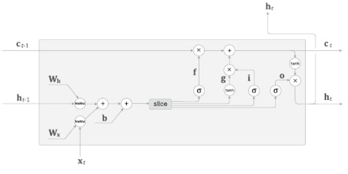

# CHAPTER 6 게이트가 추가된 RNN

최근에는 단순한 RNN 대신 LSTM이나 GPU라는 계층이 주로 쓰인다.

LSTM이나 GPU에는 '게이트(gate)'라는 구조가 더해져 있다.

게이트 덕분에 시계열 데이터의 장기 의존 관계를 학습할 수 있다.

# 1. RNN의 문제점

- RNN은 시계열 데이터의 장기 의존 관계를 학습하기 어렵다.
- BPTT에서 기울기 소실 혹은 기울기 폭발이 일어나기 때문

## 1.1 RNN 복습

- RNN 계층은 순환 경로를 가지고 있다.

- RNN 계층은 시계열 데이터 xi를 입력하면 hi를 출력한다.
- hi는 RNN계층의 은닉 상태라고 하며 과거 정보를 저장한다.
- 이전 시각의 은닉 상태를 이용한다는 점이 특징이다 - 과거 정보를 계승할 수 있게 한다.

 

RNN 계층의 계산 그래프(MatMul 노드는 행렬 곱을 나타낸다.)

## 1.2 기울기 소실 또는 기울기 폭발

RNNLM 학습의 관점에서

- 'Tom'이란 단어가 주어졌을 때, RNNLM에서 기울기가 어떻게 전파되는지 보기, BPTT로 수행
- 정답 레이블이 "Tom"이라고 주어진 시점으로부터 과거 방향으로 기울기를 전달하게 된다.

정답 레이블이 "Tom"임을 학습할 때의 기울기 흐름

- 정답레이블이 'Tom'd임을 학습할 때 중요한것이 바로 RNN 계층의 존재
- RNN계층이 과거 방향으로 '의미있는 기울기를 전달함 으로써 시간 방향의 의존관계를 학습할 수 있다.
- 기울기는 학습해야할 의미가 있는 정보가 들어 있고 그것을 과거로 전달함으로 장기의존관계를 학습한다.
- 하지만 기울기가 중간에 사그라들면 가중치 매개변수는 전혀 갱신되지 않게된다. - 장기 의존 관계를 학습할 수 없게 된다.

## 1.3 기울기 소실과 기울기 폭발의 원인

RNN 계층에서 시간 방향으로의 기울기전파

- 길이가 T인 시계열 데이터 가정
- T번째 정답 레이블이 'Tom'인 경우 시간 방향 기울기에 주목하면 역전파로 전해지는 기울기는 차례로 'tanh', '+', 'MatMul(행렬곱) 연산을 통과한다는 것을 알 수 있다.
- '+' 역전파는 상류에서 전해지는 기울기를 하류로 흘려보낼 뿐이다.

y = tanh(x)의 그래프(점선은 미분)

- 점선은 y = tanh(x)의 미분, 값은 1.0이하이고, x가 0으로부터 멀어질수록 작아진다.
- 역전파에서는 기울기가 tanh 노드를 지날 때 마다 값은 계속 작아진다는 뜻이다.
- tanh 함수를 T번 통과하면 기울기도 T번 반복해서 작아지게 된다.

RNN 계층의 행렬 곱에만 주목했을 때의 역전파의 기울기(tanh 무시)

- 상류로 부터 dh라는 기울기가 흘러온다고 가정
- MatMul 노드에서 dhWh^T라는 행렬곱으로 기울기를 계산

기울기 dh는 시간 크기에 비례해 지수적으로 증가

- 기울기의 크기는 시간에 비례해 지수적으로 증가한다.
- 이것이 기울기 폭팔이다
- 기울기 폭발이 일어나면 오버 플로를 일으켜 NaN 값을 발생시킨다.

Wh의 초깃값 변경 후 두 번째 실험

- 기울기가 지수적으로 감소한다 - 기울기 소실
- 기울기 소실이 일어나면 기울기가 매우 빠르게 작아진다.
- 기울기가 일정 수준 이하로 작아지면 가중치 매개 변수가 더 이상 갱신되지 않으므로, 장기 의존 관계를 학습 할 수 없게 된다.

## 1.4 기울기 폭발 대책

- 전통적인 기법의 기울기 클리핑(gradients clipping)

# 2. 기울기 소실과 LSTM

## 2.1 LSTM의 인터페이스

- LSTM이 기울기 소실을 일으키지 않는다 ( 일으키기 어렵게 한다.)
- LSTM은 RNN에 게이트 추가

단순화된 도법을 적용한 RNN 계층 

- tanh 계산을 노드 하나로 그림

    RNN 계층과 LSTM 계층 비교

- c라는 경로가 있다는 차이가 있다.
- c를 기억 셀(memory cell)이라 하며 LSTM의 기억 메커니즘 이다.
- 기억 셀의 특징은 데이터를 자기 자신으로만(LSTM 계층 내에서만) 주고받는다는 점이다.
- LSTM 계층 내에서만 완결되고 다른 계층으로는 출력하지 않는다.
- LSTM의 은닉상태 h는 RNN 계층과 마찬가지로 다른 계층으로(위쪽으로) 출력된다.

## 2.2 LSTM 계층 조립하기

- 기억셀 ct에는 t에서의 LSTM의 기억이 저장돼 있는데 과거로 부터 시각 T까지에 필요한 모든 정보가 저장되어있다고 가정한다.
- 필요한 정보를 모두 간직한 이 기억을 바탕으로 외부 계층에 은닉 상태 h를 출력한다
- 출력하는 ht는 기억 셀의 값을 tanh함수로 반환한 값이다.

기억셀 ct를 바탕으로 은닉상태 ht를 계산하는 LSTM 계층

게이트란

- '문'을 의미하는 단어
- 게이트는 데이터의 흐름을 제어한다.
- 물의 흐름을 멈추거나 배출하는 것이 게이트의 역할
- 다음 단계로 흘려보낼 물의 양을 제어할 수 있다.

## 2.3 output 게이트

- tanh(ct)의 각 원소에 대해 '그것이 다음 시각의 은닉 상태에 얼마나 중요한가'를 조정한다.
- 이 게이트는 다음 은닉 상태 ht의 출력을 담당하는 게이트 이므로 output 게이트(출력 게이트) 라고 한다.
- 열림 상태(다음 몇 %만 흘려보낼까)는 입력 xt와 이전상태 ht-1로 부터 구한다.
- 가중치 매개변수와 편향에는 output의 첫 글자인 o를 첨자로 추가한다.

output 게이트

output 게이트 추가

- '곱'이란 원소별 곱이며, 아다마르 곱 이라고도 한다.

## 2.4 forget 게이트

- ct-1의 기억 중에서 불필요한 기억을 잊게 해주는 게이트가 forget 게이트(망각 게이트)라고 한다.

forget 게이트 추가

forget 게이트가 수행하는 계산

- 출력 f
- f와 이전기억 셀인 ct-1과의 원소별 곱, ct = f⊙ct-1을 계산해 ct를 구한다.

## 2.5 새로운 기억 셀

- 새로 기억해야 할 정보를 기억셀에 추가 tanh 노드추가

새로운 기억 셀에 필요한 정보를 추가

- tanh노드가 계산한 결과가 이전 시각의 기억 셀 ct-1에 더해진다.

tanh 노드에서 수행하는 계산

## 2.6 input 게이트

- g에 게이트 추가

input게이트

- input 게이트는 g의 원소가 새로 추가되는 정보로써의 가치가 얼마나 큰지를 판단한다.
- 새 정보를 무비판적으로 수용하는 게 아니라 적절히 취사선택하는 것이 이게이트의 역할이다.
- input 게이트에 의해 가중된 정보가 새로 추가되는 셈이다.

input 게이트 수행 계산

## 2.7 LSTM의 기울기 흐름

기억셀의 역전파

- 기억셀의 역전파에서는 '+'와 'x' 노드만을 지나게 된다.
- '+' 노드는 상류에서 전해지는 기울기를 그대로 흘릴 뿐이다.
- 'x'노드는 '행렬 곱'이 아닌 '원소별 곱(아마다르 곱)'을 계산한다.
    - 매 시각 다른 게이트 값을 이용해 원소별 곱을 계산한다.
    - 매번 새로운 게이트 값을 이용하므로 곱셈의 효과가 누적되지 않아 기울기 소실이 일어나지 않는 것이다.
    - 'x'노드의 계산은 forget 게이트가 제어한다.
        - forget 게이트가 '잊어야 한다' 고 판단한 기억 셀의 원소에 대해서는 그 기울기가 작아진다.
        - '잊어서는 안된다'라고 판단한 원소에 대해서는 기울기가 약화되지않고 과거 방향으로 전해진다.

# 3. LSTM 구현

LSTM 수행하는 계산

- 아핀 변환(affine transformation) - 행렬 변환과 평행 이동(편향)을 결합한 상태 xWx+hWh+b

각 식 가중치들을 모아 4개의 식을 단 한번에 아핀 변환으로 계산

- 4개의 가중치(또는 편향)를 하나로 모을 수 있고, 원래 개별적으로 총 4번을 수행하던 아핀변환을 1회의 계산으로 끝낼 수 있다.
- 일반적으로 행렬 라이브러리는 '큰 행렬'을 한꺼번에 계산할 때가 각각을 계산할 때보다 빠르기 때문이다.

4개분의 가중치를 모아 아핀변환을 수행하는 LSTM 계산 그래프

- 4개분의 아핀 변환 한꺼번에 수행
- slice 노드를 통해 4개의 결과를 꺼낸다.
- slice는 아핀 변환의 결과(행렬)를 균등하게 네 조각으로 나눠서 꺼내주는 단순한 노드다.

아핀변환 시의 형상 추이(편향은 생략)

- 미니배치 수 N
- 입력 데이터의 차원수 D
- 기억 셀과 은닉 상태의 차원 수 H
- 계산 결과 A에는 네 개분의 아핀변환 결과 저장

slice 노드의 순전파(위)와 역전파(아래)

## 3.1  Time LSTM 구현

- T개 분의 시계열 데이터를 한꺼번에 처리하는 계층

Time LSTM의 입출력

Time LSTM 역전파의 입출력

# 4. LSTM을 사용한 언어 모델

언어 모델 신경망 구성(왼쪽 Time RNN, 오른쪽 Time LSTM)

# 5. RNNLM 추가 개선

## 5.1 LSTM 계층 다층화

- RNNLM으로 정확한 모델을 만들고자 한다면 많은 경우 LSTM 계층을 깊게 쌓아 (계층을 여러겹 쌓아)효과를 볼 수 있다.

LSTM 계층을 2층으로 쌓은 RNNLM

- 첫 번째 LSTM 계층의 은닉 상태가 두 번째 LSTM 계층에 입력된다.
- LSTM 계층을 몇 층이라도 쌓을 수 있으며, 덕분에 더 복잡한 패턴을 학습할 수 있게 된다.

## 5.2 드롭아웃에 의한 과접합 억제

- 층을 깊게 쌓음으로써 표현력이 풍부한 모델을 만들 수 있지만, 이런 모델은 종종  과적합을 일으킨다.
- 게다가 RNN은 일반적인 피드 포워드 신경망보다 쉽게 과적합을 일으킨다는 소식이다.
- 과적합 억제하는 전통적인 방법
    - '훈련데이터의 양 늘리기'와 모델의 복잡도 줄이기'
    - 모델의 복잡도에 페널티를 주는 정규화도 효과적이다.
    - L2 정규화는 가중치가 너무 커지면 패널티를 부과한다.
    - 드롭아웃 처럼 훈련시 계층 내의 뉴런 몇 개를 무작위로 무시하고 학습하는 방법도 일종의 정규화

드롭아웃의 개념도(왼쪽이 일반적 신경망, 오른쪽이 드롭아웃을 적용한 신경망)

- 드롭아웃은 무작위로 뉴런을 선택해 선택한 뉴런을 무시한다.
- 무시한다는 의미는 그 앞 계층으로부터의 신호 전달을 막는다는 뜻이다.
- '무작위한 무시'가 제약이 되어 일반화 성능을 개선한다.

피드포워드 신경망에 드롭아웃 계층을 적용하는 예

RNN 모델에서의 드롭아웃 계층

- 시간축 방향으로의 드롭아웃은 시간의 흐름에 따라 정보가 사라질 수 있다.
- 드롭아웃 계층을 깊이 방향(상하 방향)으로 삽입하는 방법이 좋다.
    - 시간 방향(좌우 방향)으로 아무리 진행해도 정보를 잃지 않는다.
    - 드롭아웃이 시간축과는 독립적으로 깊이 방향(상하 방향)에만 영향을 주기 때문이다.

하지만 최근 연구에서 RNN의 시간 방향 정규화를 목표로 하는 방법이 다양하게 제안 

이것이 변형 드롭아웃(Variational Dropout)

변형 드롭아웃의 예

- 색이 같은 드롭아웃끼리는 같은 마스크를 이용
- 같은 계층에 적용되는 드롭아웃 끼리는 공통의 마스크를 이용함으로 시간 방향 드롭아웃도 효과적으로 작동가능

## 5.3 가중치 공유

- 언어 모델을 개선하는 아주 간단한 트릭
- 가중치를 공유하는 효과를 준다.

언어 모델에서의 가중치 공유 예

- Embedding 계층과 Softmax 앞단의 Affinen 계층이 가중치를 공유한다.

- 가중치를 공유함으로 학습하는 매개변수 수가 크게 줄어드는 동시에 정확도도 향상되는 일석이조의 기술

## 5.4 개선된 RNNLM 구현

BetterRnnlm 클래스의 신경망 구성

개선점

1. LSTM 계층의 다층화(책은 2층)
2. 드롭아웃 사용(깊이 방향으로만 사용)
3. 가중치 적용(Embedding 계층과 Affine 계층에서 가중치 공유)

## 5.5 첨단 연구로

- 첨단연구에서의 PTB 데이터셋 테스트 데이터

PTB 데이터셋에 대한 각 모델의 퍼블렉서티 결과

# 6. 정리

- 단순한 RNN의 학습에서는 기울기 소실과 기울기 폭발이 문제가 된다.
- 기울기 폭발에는 기울기 클리핑, 기울기 소실에는 게이트가 추가된 RNN(LSTM과 GPU 등)이 효과적이다.
- LSTM에는 input 게이트, forget 게이트, output 게이트 등 3개의 게이트가 있다.
- 게이트에는 전용 가중치가 있으며 시그모이드 함수를 사용하여 0.0~1.0 사이의 실수를 출력한다.
- 언어 모델 개선에는 LSTM 계층 다층화 드롭아웃, 가중치 공유등의 기법이 효과적이다.
- RNN의 정규화는 중요한 주체이며, 드롭아웃 기반의 다양한 기법이 제안되고 있다.