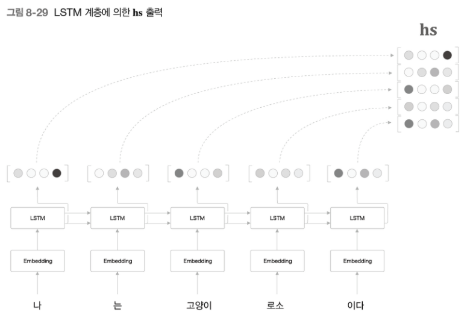
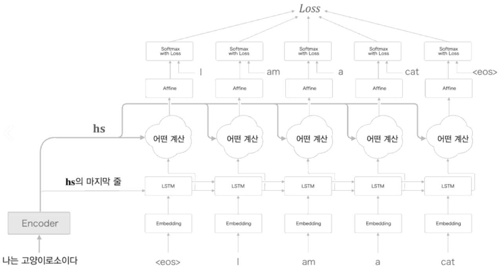
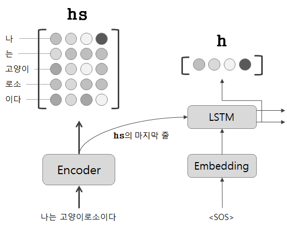
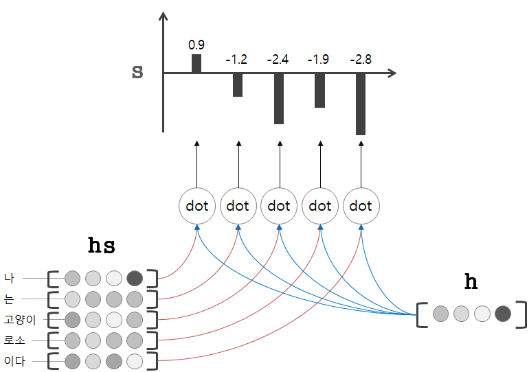
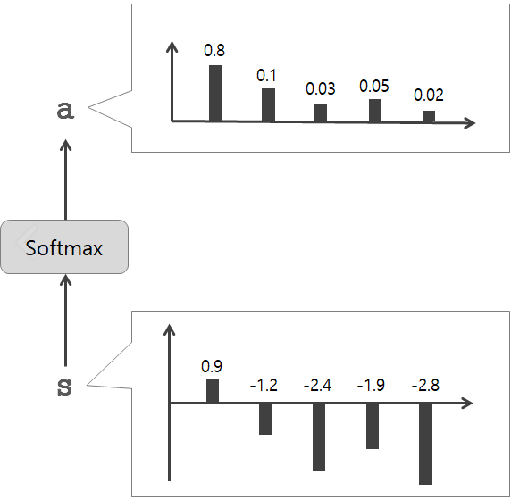
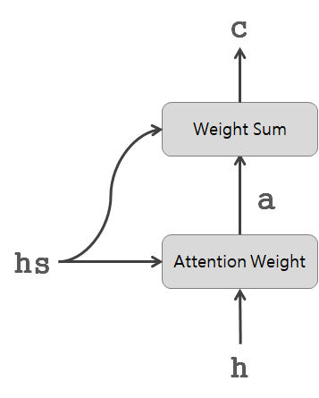
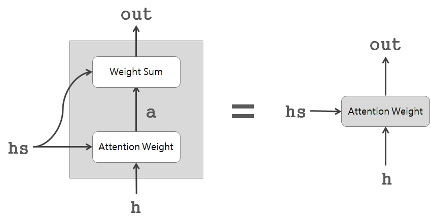
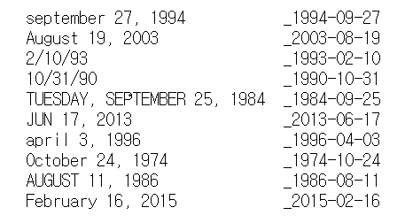
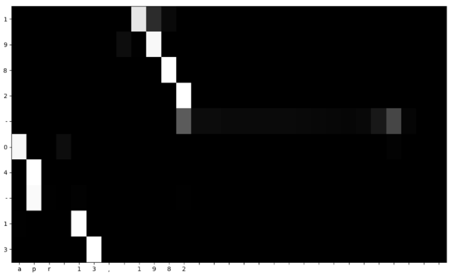
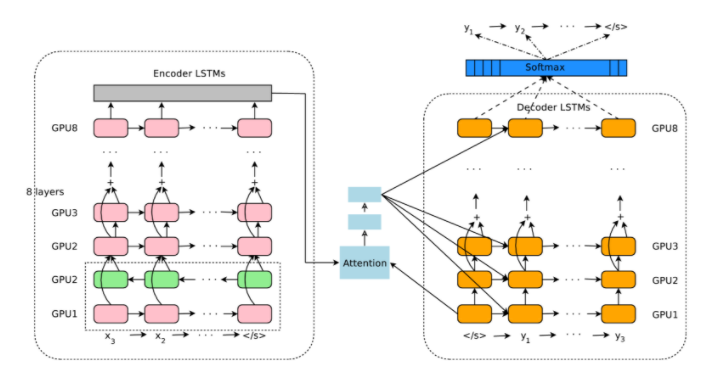

# CHAPTER 8 어텐션

seq2seq란 2개의 RNN을 연결하여 하나의 시계열 데이터를 다른 시계열 데이터로 변환하는 것이다.

이번 장에서는 seq2seq 와 RNN의 가능성을 높여주는 어텐션이란느 기술을 학습한다.

# 1. 어텐션의 구조

어텐션 매커니즘은 seq2seq를 더 강력하게 해준다.

seq2seq가 인간처럼 필요한 정보에만 주목할 수 있게 해주고 기존의 seq2seq가 갖고있던 문제점도 해결 가능하다.

## 1.1 seq2seq의 문제점

seq2seq에서 encoder가 시계열 데이터를 인코딩하고 그 인코딩된 정보를 decoder로 전달하는데 이때 encoder의 출력은 '고정 길이의 벡터'였다. 아무리 입력 문장의 길이가 길다 하더라도 같은 길이의 벡터로 변환한다.

이는 결국 필요한 정보가 벡터에 다 담기지 못하는 문제 발생

1. endoder 개선
2. decoder 개선

## 1.2 Encoder 개선

개선 포인트: encoder 출력의 길이를 입력 문장의 길이에 따라 바꿔준다.

단어별 LSTM 게층의 은닉상태 벡털르 모두 이용하는 것이다.

예를 들어 5개의 단어가 입력이 되면 encoder는 5개의 벡터를 출력한다.

각 시각별 LSTM 계층의 은닉상태에는 직전에 입력된 단어에 대한 정보가 많이 포함됨

따라서 encoder가 출력하는 hs 행렬은 각 단어에 해당하는 벡터들의 집합



## 1.3 Decoder 개선

encoder가 각단어에 대응하는 LSTM 계층의 은닉상태 벡터를 hs로 모아 출력하면 이 hs는 decoder에 전달되어 시계열 변환이 이루어진다.

개선포인트: decoder가 encoder의 LSTM 계층의 마지막 은닉 상태만을 이용하는 것이 아닌 hs를 전      

                    부 활용할 수 있도록 만드는 것

입력과 출력의 여러 단어 중 어떤 단어끼리

 서로 관련되어 있는가를 학습 시키는 구조를 **어텐션**이라 한다.

개선된 decoder 계층을 살펴보면



어떤 계산을 수행하는 계층이 추가되었다.

어떤 계산의 입력으로 encoder로부터 받는 hs와 시각별 LSTM 계층의 은닉상태를 받는다.

여기에서 필요한 정보만을 골라 Affine 계층으로 출력한다.

각 문자에서 decoder에 입력된 단어와 대응관계인 단어의 벡터를 hs에서 어떻게 골라내는데 이런 선택작업(여러 대상으로부터 몇 개를 선택하는 작업)은 미분할 수 없다. 

이런 선택 작업을 미분 가능한 연산으로 대체하기 위해 하나를 선택하는것이 아닌 모든것을 선택한다.

그리고 각 단어의 중요도를 나타내는 가중치를 별도로 계산하도록 한다.

각 단어의 중요도를 나타내는 가중치 a와 각 단어의 벡터 hs로 부터 가중합을 구하여 우리가 원하는 벡터를 얻는다 이를 맥락 벡터라고 한다.

가중치가 큰 단어의 성분을 많이 포함 하고 있으면 그 단어를 선택 한다고 해석할 수 있다.



가중치는 decoder의 LSTM계층의 은닉상태를 h라 할때 hs의 각 단어 벡터와 얼마나 비슷한가를 수치로 나타낸 것이다.

이는 내적을 이용하여 두벡터의 유사도를 표현하는 척도로 사용한다.

내적해서 나온 결과가 s이다.



s는 정규화 하기 전의 값이며 점수라고도 한다. 정규화 할때는 소프트맥스 함수를 적용한다.



 

어텐션 계층 정리



앞서 말한 어탠션 계층을 Attention Weight 가중합 계산 계층을 Weight Sum 계층 두개로 나누어서 구현한 것이다.

Attention Weight 계층은 encoder가 출력하는 각 단어의 벡터 hs에 주목해 해당 단어의 가중치 a를 구하는것

weight sum 계층은 a와 hs의 가중합을 구해 최종적으로 맥락벡터 c를 출력한다. 

이 모든 계산을 수행하는 계층을 Attention 계층이라고 한다.

어탠션 계층을 정리한 그림은 다음과 같다.



LSTM계층의 은닉 상태 벡터에 어탠션 계층의 맥락벡터까지를 Affine 계층에 입력시킨다.

마지막으로 시계열 방향으로 펼쳐진 다수의 Attention 계층을 Time Attention 계층으로 모아 구현한다

# 2. 어텐션을 갖춘 seq2seq 구현

어텐션을 갖춘 seq2seq를 구현

## 2.1 Encoder 구현

forward()메서드는 LSTM 계층의 모든 은닉 상태 벡터를 반환한다.

인수로 받고 있는 Encoder 객체는 앞 장에 LSTM 계층의 마지막 은닉 상태 벡터를 갖는데,

여기서 이를 상속 받는다.

```python

import sys
sys.path.append('..')
from common.time_layers import *
from ch07.seq2seq import Encoder, Seq2seq
from ch08.attention_layer import TimeAttention

class AttentionEncoder(Encoder):
    def forward(self, xs):
        xs = self.embed.forward(xs)
        hs = self.lstm.forward(xs)
        return hs

    def backward(self, dhs):
        dout = self.lstm.backward(dhs)
        dout = self.embed.backward(dout)
        return dout
```

## 2.2 Decoder 구현

forward() 메서드에서 Time attention 계층의 출력과 LSTM 계층의 출력을 연결한다.

연결시에는 np.concatenate() 사용한다.

```python
class AttentionDecoder:
    def __init__(self, vocab_size, wordvec_size, hidden_size):
        V, D, H = vocab_size, wordvec_size, hidden_size
        rn = np.random.randn

        embed_W = (rn(V, D) / 100).astype('f')
        lstm_Wx = (rn(D, 4 * H) / np.sqrt(D)).astype('f')
        lstm_Wh = (rn(H, 4 * H) / np.sqrt(H)).astype('f')
        lstm_b = np.zeros(4 * H).astype('f')
        affine_W = (rn(2*H, V) / np.sqrt(2*H)).astype('f')
        affine_b = np.zeros(V).astype('f')

        self.embed = TimeEmbedding(embed_W)
        self.lstm = TimeLSTM(lstm_Wx, lstm_Wh, lstm_b, stateful=True)
>         self.attention = TimeAttention()
        self.affine = TimeAffine(affine_W, affine_b)
        layers = [self.embed, self.lstm, self.attention, self.affine]

        self.params, self.grads = [], []
        for layer in layers:
            self.params += layer.params
            self.grads += layer.grads

    def forward(self, xs, enc_hs):
        h = enc_hs[:,-1]
        self.lstm.set_state(h)

        out = self.embed.forward(xs)
        dec_hs = self.lstm.forward(out)
        c = self.attention.forward(enc_hs, dec_hs)
        out = np.concatenate((c, dec_hs), axis=2)
        score = self.affine.forward(out)

        return score

    def backward(self, dscore):
        dout = self.affine.backward(dscore)
        N, T, H2 = dout.shape
        H = H2 // 2

        dc, ddec_hs0 = dout[:,:,:H], dout[:,:,H:]
        denc_hs, ddec_hs1 = self.attention.backward(dc)
        ddec_hs = ddec_hs0 + ddec_hs1
        dout = self.lstm.backward(ddec_hs)
        dh = self.lstm.dh
        denc_hs[:, -1] += dh
        self.embed.backward(dout)

        return denc_hs

    def generate(self, enc_hs, start_id, sample_size):
        sampled = []
        sample_id = start_id
        h = enc_hs[:, -1]
        self.lstm.set_state(h)

        for _ in range(sample_size):
            x = np.array([sample_id]).reshape((1, 1))

            out = self.embed.forward(x)
            dec_hs = self.lstm.forward(out)
>             c = self.attention.forward(enc_hs, dec_hs)
>             out = np.concatenate((c, dec_hs), axis=2)
            score = self.affine.forward(out)

            sample_id = np.argmax(score.flatten())
            sampled.append(sample_id)

        return sampled
```

## 2.3 seq2seq 구현

AttentionEncoder 와 AttentionDecoder을 연결하여 AttentionSeq2seq 클래스를 완성한다.

```python
class AttentionSeq2seq(Seq2seq):
    def __init__(self, vocab_size, wordvec_size, hidden_size):
        args = vocab_size, wordvec_size, hidden_size
         self.encoder = AttentionEncoder(*args)
         self.decoder = AttentionDecoder(*args)
        self.softmax = TimeSoftmaxWithLoss()

        self.params = self.encoder.params + self.decoder.params
        self.grads = self.encoder.grads + self.decoder.grads
```

# 3. 어텐션 평가

## 3.1 날짜 형식 변환 문제

날짜형식을 변경하는 문제로 어텐션을 갖춘 seq2seq의 효과를 확인

영어권에서 사용되는 다양한 날짜 형식을 표준형식으로 변환 목표

예를 들어 "september 27, 1994"등의 날짜 데이터를 "1994-09-27"같은 표준 형식으로 변환



## 3.2 어텐션을 갖춘 seq2seq의 학습

학습코드

```python
import sys
sys.path.append('..')
sys.path.append('../ch07')
import numpy as np
import matplotlib.pyplot as plt
from dataset import sequence
from common.optimizer import Adam
from common.trainer import Trainer
from common.util import eval_seq2seq
from attention_seq2seq import AttentionSeq2seq
from ch07.seq2seq import Seq2seq
from ch07.peeky_seq2seq import PeekySeq2seq

# 데이터 읽기
(x_train, t_train), (x_test, t_test) = sequence.load_data('date.txt')
char_to_id, id_to_char = sequence.get_vocab()

# 입력 문장 반전
> x_train, x_test = x_train[:, ::-1], x_test[:, ::-1]

# 하이퍼파라미터 설정
vocab_size = len(char_to_id)
wordvec_size = 16
hidden_size = 256
batch_size = 128
max_epoch = 10
max_grad = 5.0

 model = AttentionSeq2seq(vocab_size, wordvec_size, hidden_size)
# model = Seq2seq(vocab_size, wordvec_size, hidden_size)
# model = PeekySeq2seq(vocab_size, wordvec_size, hidden_size)

optimizer = Adam()
trainer = Trainer(model, optimizer)

acc_list = []
for epoch in range(max_epoch):
    trainer.fit(x_train, t_train, max_epoch=1,
                batch_size=batch_size, max_grad=max_grad)

    correct_num = 0
    for i in range(len(x_test)):
        question, correct = x_test[[i]], t_test[[i]]
        verbose = i < 10
        correct_num += eval_seq2seq(model, question, correct,
                                    id_to_char, verbose, is_reverse=True)

    acc = float(correct_num) / len(x_test)
    acc_list.append(acc)
    print('정확도 %.3f%%' % (acc * 100))

model.save_params()

# 그래프 그리기
x = np.arange(len(acc_list))
plt.plot(x, acc_list, marker='o')
plt.xlabel('에폭')
plt.ylabel('정확도')
plt.ylim(-0.05, 1.05)
plt.show()
```

## 3.3 어텐션 시각화

어텐션이 시계열 데이터를 변환할 때 어떤 원소에 주의를 기울이는지 보기 위해 시각화

가로축은 입력 문장, 세로축은 출력문장 맵의 각 원소는 밝을 수록 값이 크다.



AUGUST일때 월을 뜻하는08에 대응 하고있다

seq2seq가 august가 8월에 대응한다는 사실을 데이터만 가지고 학습

어텐션을 사용해 단어와 단어의 관련성을 볼수있고 이를 통해 모델의 처리가 인간의 논리를 따르는지 판단 가능

# 4. 어텐션에 관한 남은 이야기

## 4.1 양방향 RNN

앞에서 단방향 RNN을 보았을 때, LSTM 의 각 시각의 은닉 상태 벡터는 hs로 모아진다. 

그리고 Encoder가 출력하는 hs의 각 행에는 그 행에 대응하는 단어의 성분이 많이 포함되어있다. 글을 왼쪽에서 오른쪽으로 읽기때문에, '나는 고양이로소이다' 라는 문장에서 '고양이'에 대응하는 벡터에는 '나', '는'', '고양이' 까지 총 세 단어의 정보가 인코딩되어 들어간다. 

'고양이'단어의 '주변'정보를 균형있게 담고싶을때 LSTM을 양뱡향으로 처리

이것이**양방향 LSTM**이다.

전에 했던 LSTM 계층에, 역방향으로 처리하는 LSTM 계층도 추가한다. 각 시각에서는 이 두 LSTM 계층의 은닉상태를 '연결'시킨 벡터를 최종 은닉 상태로 처리한다.

역방향으로 처리하는 LSTM 계층에 반대순서로 단어를 나열하여 넣는다. 즉, 오른쪽에서 왼쪽으로 처리한다. 이 두 계층을 연결하기만 하면 양뱡향 LSTM 계층이 나온다.

## 4.2 Attention 계층 사용 방법

앞에선 Attention 계층을 LSTM 계층과 Affine 계층 사이에 삽입했지만,

Attention 계층을 이용하는 장소가 정해져 있지는 않다.

LSTM 계층 전에 넣어, LSTM 계층의 입력으로 사용할 수 있다.

## 4.3 seq2seq 심층화와 skip연결

**seq2seq을 심층화**

할때 쉽게 떠올릴 수 있는건 RNN층을 깊게 쌓는 방법이다. 

그러면 표현력이 높은 모델을 만들 수 있다.

보통은 Encoder와 Decoder 에서는 같은 층수의 LSTM 계층을 이용하는것이 일반적인데, 여러가지 변형을 하면서, Decoder의 LSTM 계층의 은닉 상태를 Attention 계층에 입력하고, Attention 계층의 출력인 맥락벡터를 Decoder의 여러 계층(LSTM 계층과 Affine계층) 으로 전파할 수 있다.

**skip 연결**

 층을 깊에 할때 사용하는 중요한 기법이다. 

계층을 넘어(=계층을 건너 뛰어) '선을 연결'하는 단순한 기법이다. 이때

 skip 연결의 접속부에서는 2개의 출력이 더해진다. 왜냐햐면,덧셈은 역전파시 기울기를 흘려 보내므로, skip 연결의 기울기가 아무런 영향을 받지 않고 모든 계층으로 흐르기 때문이다.

 따라서 층이 깊어져도 기울기가 소실되지 않고 전파되어 잘 학습된다. ( LSTM 개념과 비슷)

# 5. 어텐션 응용

## 5.1 구글 신경망 기계 번역(GNMT)

기계번역의 역사를 보면 다음과 같이 변화해왔다.

규칙 기반 번역 -> 용례 기반 번역 -> 통계 기반 번역

현재는**신경망 기계 번역(NMT)**이 주목받고 있다.

계층 구성은 다음과 같다.



번역 정확도를 높이기 위해 LSTM 계층의 다층화, 양방향 LSTM, skip 연결 등을 추가했다. 

그리고 학습 시간을 단축하기 위해 GPU로 분산학습을 수행

이외에도 낮은 빈도의 단어처리나 추론 고속화를 위한 양자화 등의 연구

## 5.2 트랜스포머

RNN의 단점 중 하나는 병렬처리다. 

RNN은 이전 시각에 계산한 결과를 이용하여 순서대로 계산하기 때문에 RNN 의 계산을 시간방향으로 병렬계산하기란 기본적으로 불가능하다 

이는 딥러닝 학습이 GPU를 사용한 병렬계산환경에서 이뤄진다는 점을 생각할때 큰 병목이다. 이것의 해결방안을 제안한 연구중 트랜스포머 기법이 유명하다.

**셀프어탠션** 기술을 이용해 어탠션을 구성하는 것이 핵심이다.

하나의 시계열 데이터 내에서 각 원소가 다른 원소들과 어떻게 관련되는지를 살펴보자는 취지다. 

앞서 보았던 어텐션에서는 2개의 서로다른 시계열 데이터(hs_enc, hs_dec) 사이의 대응관계를 구했으나, 셀프어텐션은 두 입력선이 하나의 시계열 데이터로부터 나온다.

트랜스포머는 RNN 대신 어텐션을 사용한다. encoder, decoder 모두 셀프어텐션을 사용한다. 또 피드포워드 신경망(시간 방향으로 독립적으로 처리하는 신경망) 을 넣는다. 은닉층 1개, 활성화 함수로 ReLU 를 이용해 완전연결계층 신경망을 이용한다.

## 5.3 뉴럴 튜링 머신(NTM)

외부 메모리를 통한 확장을 통해 성능을 끌어올릴 수 있다. RNN 과 LSTM 은 내부 상태를 활용해 시계열 데이터를 기억할 수 있었으나 길이가 고정이어 채워넣을 수 있는 정보량이 제한적이어서, RNN 외부 기억장치를 두고 필요한 정보를 거기에 적절히 기록하는 방안을 찾아낸 것이다

- 순환신경망을 통한 제어기와 외부 메모리를 결합하는 딥러닝 모델
- 벡터 연산으로 동작하는 미분 가능한 기계학습 기반의 튜링머신

메모리 조작 순서도 데이터로부터 학습 

**콘텐츠 기반 어텐션과 위치 기반 어텐션**

콘텐츠 기반 어텐션은 지금까지 본 어텐션과 같고, 입력으로 주어진 질의 벡터와 비슷한 벡터를 메모리에서 찾아낸다. 

위치 기반 어텐션은 이전 시각에서 주목한 메모리의 위치를 기준으로 그 전후로 이동(=시프트)하는 용도로 사용된다. 메모리를 읽어 나가는 컴퓨터 특유의 움직임을 재현했다고 볼 수 있다.

# 6. 정리