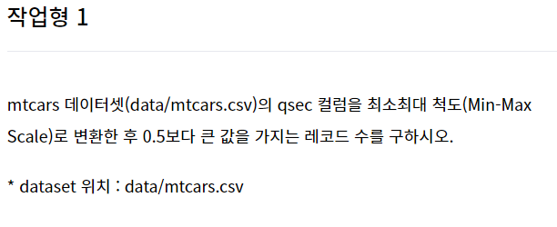
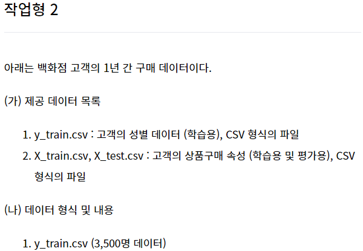
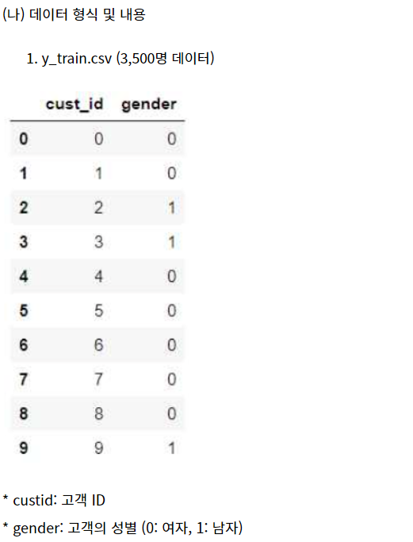
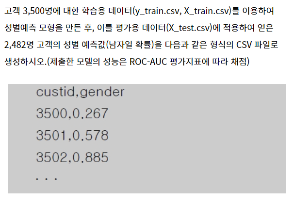
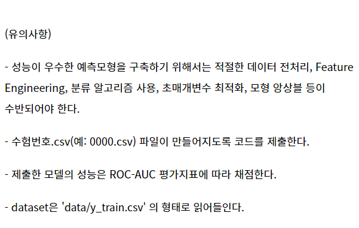

# 빅데이터 분석기사 실기 준비

1. 작업형

   

```python
import pandas as pd
import numpy as np

df = pd.read_csv('data/mtcars.csv')
subdf = df['qsec']
x = subdf.values.reshape(-1,1)

from sklearn.preprocessing import MinMaxScaler
scaler = MinMaxScaler()
y = scaler.fit_transform(x)

print((y>0.5).sum())
```


2. 작업형 

   

   

   

   

```python
import pandas as pd
from sklearn.model_selection import train_test_split
from sklearn.ensemble import GradientBoostingClassifier, RandomForestClassifier, VotingClassifier
from sklearn.preprocessing import StandardScaler, MinMaxScaler
from sklearn.metrics import classification_report

y_train = pd.read_csv('data/y_train.csv')
X_train = pd.read_csv('data/X_train.csv', encoding='UTF8')
test = pd.read_csv('data/X_test.csv', encoding='UTF8')

## 데이터 load
# Q1 y_train, X_train 데이터를 합쳐 trainDf 변수에 저장하라
trainDf = pd.merge(y_train,X_train)
# print(trainDf.head(3))

## 데이터 전처리
# 데이터 타입 확인
# print(trainDf.info())
# print(trainDf.describe())

# Q2 trainDf와 X_test의 결측치가 있는 컬럼의 숫자 및 결측치 숫자를 파악하고 결측치처리 방식에 대해 생각해보자

# null값 처리
trainNAN = pd.isnull(trainDf).sum()
# print(trainNAN)
testNAN = pd.isnull(test).sum()
# print(testNAN)
isnullGender = trainDf[trainDf['환불금액'].isnull()].gender.value_counts()
# print(isnullGender.index)
# print(isnullGender.values)
# print(trainDf['환불금액'].describe())

# null값 0으로 채우기
trainDf['환불금액'] = trainDf['환불금액'].fillna(0)
test['환불금액'] = test['환불금액'].fillna(0)
# print(trainDf)
# print(test)

# feature engineering
# 음수 데이터 삭제
trainDf = trainDf[trainDf['총구매액']>0]
# ---------------------------생략----------------------------------------
trainDf['최초구매액'] = trainDf['총구매액'] + trainDf['환불금액'] + 1
trainDf['최대구매액비율'] = trainDf['최대구매액']/trainDf['최초구매액']
trainDf['환불금액비율'] = trainDf['환불금액']/trainDf['최초구매액']
trainDf['총구매건수'] = trainDf['내점일수']*trainDf['내점당구매건수']


test['최초구매액'] = test['총구매액'] + test['환불금액'] + 1
test['최대구매액비율'] = test['최대구매액']/test['최초구매액']
test['환불금액비율'] = test['환불금액']/test['최초구매액']
test['총구매건수'] = test['내점일수']*test['내점당구매건수']
# print(trainDf.describe())

# 값이 1개인 범주형 데이터 삭제
trainDf = trainDf.loc[trainDf['주구매지점'] != '상인점']

corr = trainDf.corr(method = 'pearson')
print(corr)

# Q3 범주형 변수의 유일값과 유일값의 갯수를 파악하라
main_index = trainDf['주구매상품'].value_counts().index
# print('상품 수:', len(main_index))
# print('상품 리스트:', list(main_index))

main_center = trainDf['주구매지점'].value_counts().index
# print('지점 수:', len(main_center))
# print('지점 리스트:', list(main_center))

# ---------------------------생략---------------------------------

## 데이터 모델링
x = trainDf.drop(['cust_id','gender'],axis=1)
y = trainDf.gender

x_dum = pd.get_dummies(x)
test_dum = pd.get_dummies(test)

# test에 없는 train features 채우기
missing_cols = set( x_dum.columns ) - set( test_dum.columns )
for c in missing_cols:
	test_dum[c] = 0
test_dum = test_dum[x_dum.columns]

# 스케일 처리
sc = MinMaxScaler()
sc.fit(x_dum)
x_dum = sc.transform(x_dum)
text_dum = sc.transform(test_dum)

X_train, X_test, y_train, y_test = train_test_split(x_dum, y, test_size=0.3, random_state=60, stratify=y)

# GBC_best # RFC Parameters tunning 
GBC = GradientBoostingClassifier(random_state=60)
RFC = RandomForestClassifier(random_state=60)

# Voting
votingC = VotingClassifier(estimators=[('rfc', RFC), ('gbc', GBC)], voting='soft')
votingC = votingC.fit(X_train, y_train)

# 마지막 매개변수 최적화 후
# votingC = votingC.fit(x_dum, y)


y_pred = votingC.predict(X_test)
report =classification_report(y_test, y_pred, target_names=['class 0', 'class 1'])
print(report)


# test 결과 데이터셋 생성
test_gender = pd.Series(votingC.predict_proba(test_dum)[:,1], name="gender")
results= pd.concat([test.cust_id, test_gender],axis=1)
# 결과
print(results)
results.to_csv("20150489.csv",index=False)
```


```python
import pandas as pd

test = pd.read_csv('data/X_test.csv')
X_train = pd.read_csv('data/X_train.csv')
y_train = pd.read_csv('data/y_train.csv')

trainDf = pd.merge(X_train, y_train)

trainDf['환불금액'] = trainDf['환불금액'].fillna(0)
test['환불금액'] = test['환불금액'].fillna(0)

X = trainDf.drop(['cust_id', 'gender'], axis=1)
y = trainDf['gender']


X_dum = pd.get_dummies(X)
test_dum = pd.get_dummies(test)

missing_col = set(X_dum.columns) - set(test_dum.columns)
for c in missing_col:
	test_dum[c] = 0

test_dum = test_dum[X_dum.columns]

from sklearn.preprocessing import MinMaxScaler
sc = MinMaxScaler()
sc.fit(X_dum)
X_dum = sc.transform(X_dum)
test_dum = sc.transform(test_dum)


from sklearn.model_selection import train_test_split
X_train, X_test, y_train, y_test = train_test_split(X_dum, y, stratify=y)


from sklearn.ensemble import RandomForestClassifier, GradientBoostingClassifier, VotingClassifier

GBC = GradientBoostingClassifier()
RFC = RandomForestClassifier()

votingC = VotingClassifier([('GBC', GBC), ('RFC',RFC)], voting='soft')
votingC.fit(X_train, y_train)

from sklearn.metrics import classification_report
y_prob = votingC.predict(X_test)
report = classification_report(y_prob, y_test)

votingC.fit(X_dum, y)
result = pd.Series(votingC.predict_proba(test_dum)[:,1])


result = pd.concat([test['cust_id'], result], axis=1)
result.columns = ['custid', 'gender']
result.to_csv('20150.csv', index=False)

check = pd.read_csv('20150.csv')
print(check)
```


기출문제1 데이터 변환 문제

기출문제2 분류 문제 